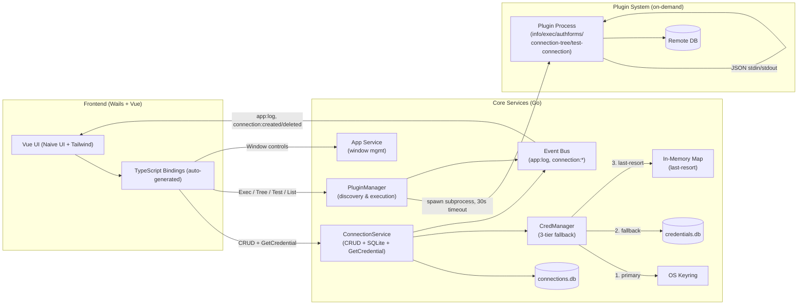
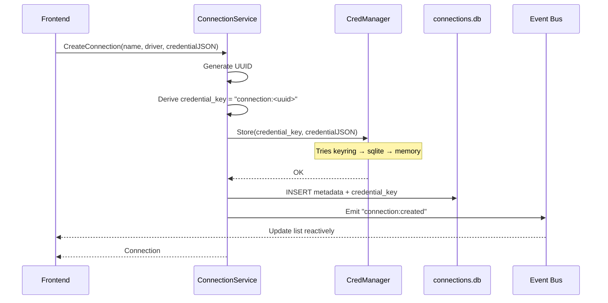
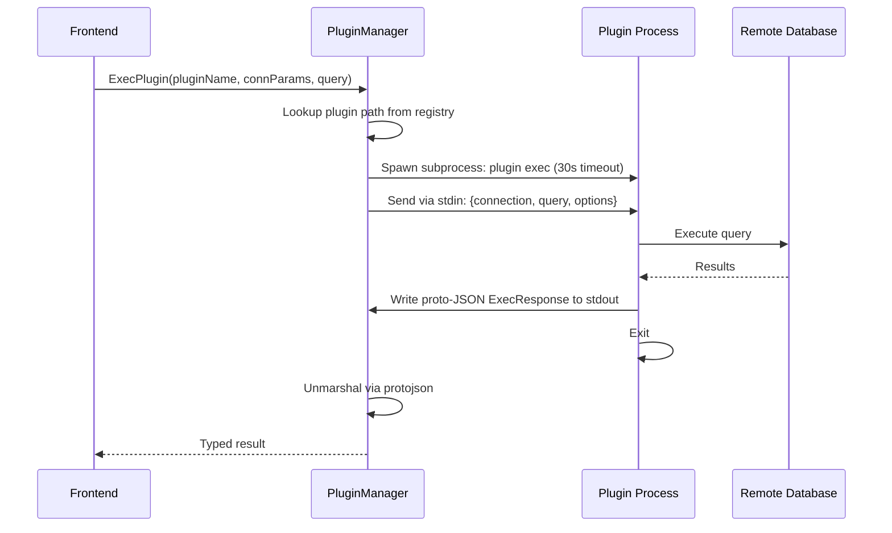
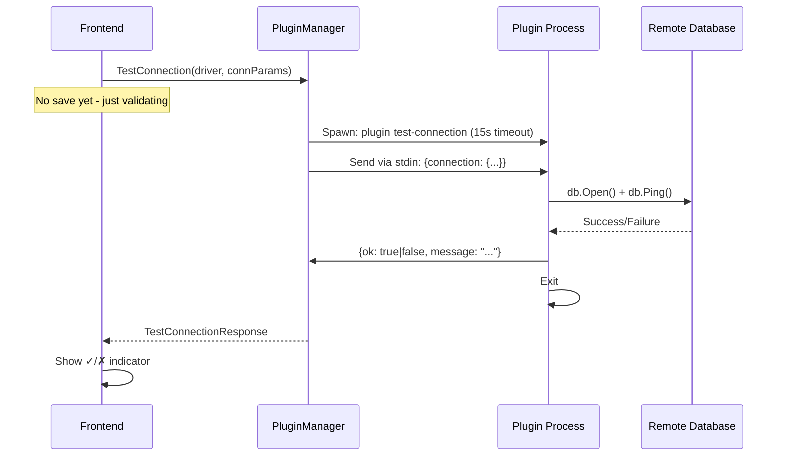

QueryBox is built with a clean separation between the frontend UI, core Go services, and an extensible plugin system. This architecture enables language-agnostic database drivers while maintaining performance and security.

## System Overview

## Core Components

QueryBox's backend is organized into focused services that handle specific responsibilities:

| Component | Location | Wails-bound | Responsibility |
|-----------|----------|-------------|----------------|
| App Service | `services/app.go` | ✓ | Window lifecycle (maximize, minimize, fullscreen, close) |
| ConnectionService | `services/connection.go` | ✓ | Connection CRUD, credential delegation, event emission |
| PluginManager | `services/pluginmgr/pluginmgr.go` | ✓ | Plugin discovery, registry, on-demand execution |
| CredManager | `services/credmanager/credmanager.go` | ✗ | Secure secret storage with 3-tier fallback |

<Note>
Services marked as "Wails-bound" expose methods directly to the frontend via auto-generated TypeScript bindings.
</Note>

### ConnectionService API

The ConnectionService provides the primary interface for managing database connections:

| Method | Signature | Description |
|--------|-----------|-------------|
| `ListConnections` | `(ctx) → ([]Connection, error)` | All connections, newest first |
| `CreateConnection` | `(ctx, name, driverType, credential) → (Connection, error)` | Store credential via CredManager, persist metadata, emit `connection:created` |
| `GetConnection` | `(ctx, id) → (Connection, error)` | Single connection by ID |
| `GetCredential` | `(ctx, id) → (string, error)` | Raw credential blob for plugin requests |
| `DeleteConnection` | `(ctx, id) → error` | Delete metadata + credential, emit `connection:deleted` |

### PluginManager API

The PluginManager handles all plugin lifecycle and execution:

| Method | Description |
|--------|-------------|
| `ListPlugins()` | Returns all discovered plugins with rich metadata |
| `Rescan()` | Immediate synchronous plugin scan |
| `ExecPlugin(name, conn, query, opts)` | Run `plugin exec`, 30s timeout → `ExecResponse` |
| `GetPluginAuthForms(name)` | Run `plugin authforms` → structured auth form definitions |
| `GetConnectionTree(name, conn)` | Run `plugin connection-tree`, 30s timeout → `ConnectionTreeResponse` |
| `ExecTreeAction(name, conn, query, opts)` | Delegates to `ExecPlugin` with action query |
| `TestConnection(name, conn)` | Run `plugin test-connection`, **15s** timeout → `TestConnectionResponse` |

## Key Flows

### Connection Creation

<Info>
Credentials are never stored in the main `connections.db`. Only a reference key is persisted, with the actual secret managed by CredManager's secure storage tiers.
</Info>

### Query Execution

<Note>
Plugins are **single-shot processes**. Each request spawns a new subprocess that exits after responding. This keeps the system simple and isolates failures.
</Note>

### Connection Tree Browsing

1. Frontend → `PluginManager.GetConnectionTree(pluginName, connParams)`
2. Spawns `plugin connection-tree`, 30s timeout; stdin: `{"connection": {...}}`
3. Plugin returns `{"nodes": [...]}` — hierarchical structure with optional `actions` per node
4. Node action → `ExecTreeAction` → delegates to `ExecPlugin` with action's query string

### Test Connection (no persistence)

<Info>
Test connection uses a shorter **15s timeout** compared to the standard 30s for query execution, providing faster feedback during connection setup.
</Info>

### Connection Deletion

1. Frontend → `ConnectionService.DeleteConnection(id)`
2. Look up `credential_key`, call `CredManager.Delete`
3. Remove row from `data/connections.db`
4. `connection:deleted` event emitted → frontend removes entry from state

## Event-Driven Updates

QueryBox uses Wails events to maintain reactive state synchronization:

- `connection:created` — Emitted after successful connection creation
- `connection:deleted` — Emitted after successful connection deletion
- `app:log` — Application-level logging events

<Warning>
Events are emitted **strictly after** successful database writes — never speculatively. This ensures the frontend state always reflects persisted data.
</Warning>

## Design Principles

### Single-Shot Plugin Execution

Plugins are ephemeral processes that:
- Spawn on-demand for each request
- Communicate via JSON on stdin/stdout
- Exit immediately after responding
- Have no persistent state between calls

This design provides:
- **Isolation** — Plugin crashes don't affect the host
- **Simplicity** — No IPC complexity or connection pooling
- **Language agnostic** — Any executable can be a plugin

### Credential Isolation

Credentials flow through the system with strict boundaries:
- `ConnectionService` stores only a reference key in metadata
- `CredManager` handles all secret storage and retrieval
- Plugins receive credentials only during execution
- Frontend never caches credential values

### Reactive State Management

The frontend maintains local state but relies on backend events for updates:
- No polling for connection list changes
- Optimistic UI updates backed by event confirmation
- Single source of truth in SQLite

<Expandable title="Why not use a persistent plugin pool?">
While persistent plugins would reduce startup overhead, the single-shot model provides significant advantages:

- **Crash isolation** — A failing plugin can't wedge the application
- **Resource cleanup** — No connection leaks or zombie processes
- **Simpler implementation** — No IPC protocol or lifecycle management
- **Development velocity** — Restart the plugin binary without restarting the host

For typical query workloads (1-30 seconds), subprocess spawn overhead (10-50ms) is negligible.
</Expandable>