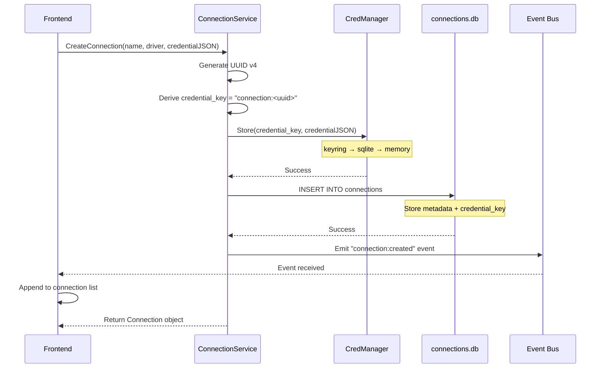
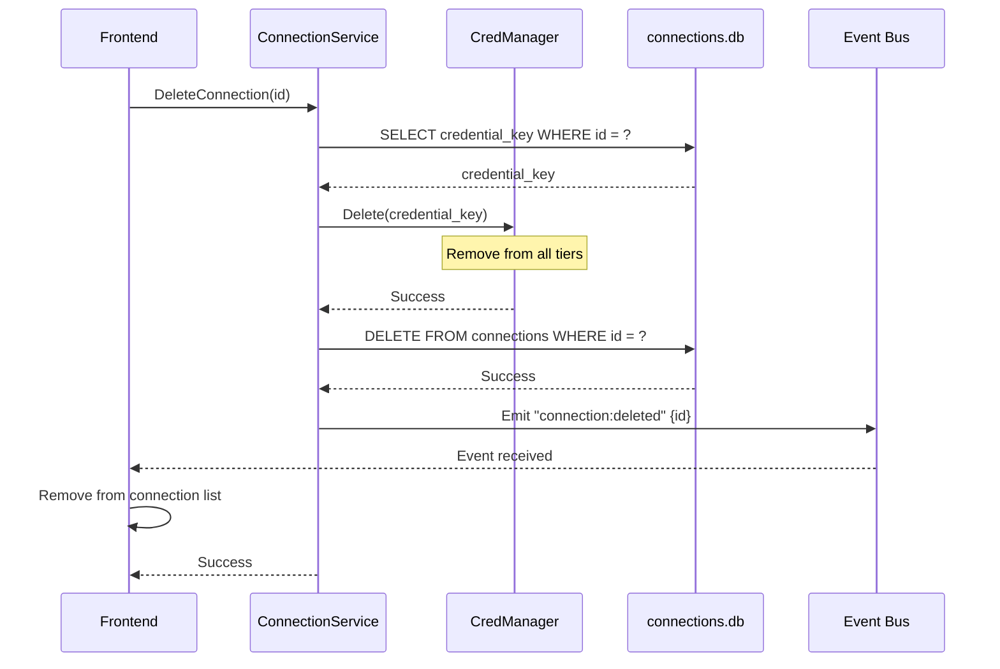
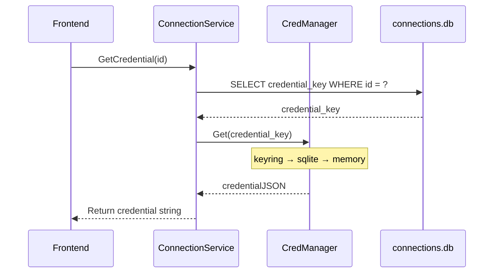

`ConnectionService` owns the complete lifecycle of database connections. It stores metadata in SQLite, delegates credential storage to `CredManager`, and emits Wails events for reactive frontend updates.

**Location**: `services/connection.go`

## API

The ConnectionService exposes these methods via Wails bindings:

| Method | Signature | Description |
|--------|-----------|-------------|
| `ListConnections` | `(ctx) → ([]Connection, error)` | All connections, newest first |
| `CreateConnection` | `(ctx, name, driverType, credential) → (Connection, error)` | Store secret via CredManager; persist metadata; emit `connection:created` |
| `GetConnection` | `(ctx, id) → (Connection, error)` | Fetch single connection by UUID |
| `GetCredential` | `(ctx, id) → (string, error)` | Raw credential JSON for building plugin requests |
| `DeleteConnection` | `(ctx, id) → error` | Remove metadata + credential; emit `connection:deleted` |

<Info>
All mutations emit Wails events **after** successful database writes, enabling reactive frontend state updates without polling.
</Info>

## Connection Structure

Connections are represented with this structure:

```go
type Connection struct {
    ID            string `json:"id"`            // UUID v4
    Name          string `json:"name"`          // User-defined label
    DriverType    string `json:"driver_type"`   // Plugin name (e.g., "mysql")
    CredentialKey string `json:"credential_key"` // Reference key, not the secret
    CreatedAt     string `json:"created_at"`    // ISO 8601 timestamp
    UpdatedAt     string `json:"updated_at"`    // ISO 8601 timestamp
}
```

<Warning>
`credential_key` is a reference (format: `"connection:<uuid>"`) — **never** the actual credential. Secrets are stored separately via `CredManager`.
</Warning>

## Connection Lifecycle

### Create Flow



**Step-by-step**:

1. Frontend calls `CreateConnection(name, driver, credentialJSON)`
2. ConnectionService generates a UUID v4
3. Derives `credential_key = "connection:<uuid>"`
4. Calls `CredManager.Store(credential_key, credentialJSON)`
   - Tries OS keyring first
   - Falls back to SQLite file
   - Last resort: in-memory storage
5. Inserts metadata + `credential_key` into `data/connections.db`
6. Emits `connection:created` event with the Connection object
7. Frontend receives event and updates list reactively (no re-fetch needed)

<Note>
Credentials are stored **before** metadata. If credential storage fails, the connection is not created.
</Note>

### Delete Flow



**Step-by-step**:

1. Frontend calls `DeleteConnection(id)`
2. ConnectionService queries `credential_key` for the connection
3. Calls `CredManager.Delete(credential_key)` to remove from all storage tiers
4. Deletes metadata row from `data/connections.db`
5. Emits `connection:deleted` event with the connection ID
6. Frontend receives event and removes entry from state

### Credential Retrieval (for plugin execution)



**Step-by-step**:

1. Frontend calls `GetCredential(id)` when preparing a plugin request
2. ConnectionService queries `credential_key` from metadata
3. Calls `CredManager.Get(credential_key)` to retrieve the secret
4. Returns raw credential JSON string
5. Frontend passes this JSON as the `connection` parameter to plugin commands

<Info>
`GetCredential` is intentionally a **separate call** so the frontend can defer credential fetch until plugin execution time. Credentials are never cached in the UI.
</Info>

## Event-Driven Updates

ConnectionService emits Wails events for all mutations:

### connection:created

Emitted after successful connection creation:

```json
{
  "id": "550e8400-e29b-41d4-a716-446655440000",
  "name": "Production MySQL",
  "driver_type": "mysql",
  "credential_key": "connection:550e8400-e29b-41d4-a716-446655440000",
  "created_at": "2026-03-01T10:30:00Z",
  "updated_at": "2026-03-01T10:30:00Z"
}
```

Frontend action: Append to connection list without re-fetching.

### connection:deleted

Emitted after successful connection deletion:

```json
{
  "id": "550e8400-e29b-41d4-a716-446655440000"
}
```

Frontend action: Remove from connection list by ID.

<Warning>
Events are emitted **strictly after** successful database writes — never speculatively. This ensures the frontend state always reflects persisted data.
</Warning>

## Storage Details

### Metadata Storage

Connection metadata is stored in `data/connections.db`:

- **Engine**: SQLite
- **Pool size**: Max 1 connection
- **Connection lifetime**: 5 minutes
- **Schema**: Auto-created on startup

**Table structure**:

```sql
CREATE TABLE connections (
    id TEXT PRIMARY KEY,
    name TEXT NOT NULL,
    driver_type TEXT NOT NULL,
    credential_key TEXT NOT NULL,
    created_at TEXT NOT NULL,
    updated_at TEXT NOT NULL
);
```

### Credential Storage

Credentials are **never** stored in `connections.db`. They are managed by `CredManager` using a 3-tier fallback system:

1. **OS Keyring** (primary)
2. **SQLite file** (`data/credentials.db`) (fallback)
3. **In-memory map** (last resort)

See [Credential Storage](/concepts/credential-storage) for details.

## Implementation Notes

### Credential Key Format

Credential keys use the format `"connection:<uuid>"` where the UUID matches the connection ID. This provides:

- **Namespace isolation** — Won't conflict with other keyring entries
- **Deterministic lookup** — Can reconstruct key from connection ID
- **Audit trail** — Key format is self-documenting

### Concurrent Access

ConnectionService is safe for concurrent access:

- SQLite connections use `database/sql` which is goroutine-safe
- Pool size of 1 serializes writes naturally
- Reads can happen concurrently via the connection pool

### Error Handling

#### Creation Errors

If credential storage fails:
- Connection is **not** created
- No metadata row inserted
- No event emitted
- Error returned to frontend

If metadata insertion fails after credential storage:
- Credential remains in CredManager (orphaned)
- Error returned to frontend
- Manual cleanup may be needed

<Note>
Orphaned credentials are rare and harmless. They consume minimal space and can be manually deleted from the keyring if needed.
</Note>

#### Deletion Errors

Credential deletion is best-effort:
- Keyring deletion errors are logged but not fatal
- Metadata is always deleted
- Event is always emitted

This prevents stuck connections when the keyring is unavailable.

### Testing Connections

Connection testing is handled by `PluginManager.TestConnection`, **not** ConnectionService:

1. Frontend collects connection parameters from the form
2. Calls `PluginManager.TestConnection(driver, params)` directly
3. Plugin validates and returns `{ok, message}`
4. Frontend shows inline indicator
5. **No** persistence until user clicks Save

This allows users to validate parameters before creating the connection.

## Best Practices

### Frontend Integration

<Expandable title="Reactive state management">
1. **Initial load**: Call `ListConnections()` once on app startup
2. **Listen for events**: Subscribe to `connection:created` and `connection:deleted`
3. **Optimistic updates**: Update local state based on events, no re-fetch
4. **Defer credentials**: Only call `GetCredential()` when executing a query
5. **Never cache credentials**: Fetch fresh for each plugin request
</Expandable>

### Error Display

Show user-friendly errors:

- `"credential storage failed"` → "Unable to securely store credentials. Try restarting."
- `"connection not found"` → "This connection no longer exists."
- `"credential not found"` → "Credentials not available. You may need to recreate this connection."

### Connection Naming

Encourage descriptive names:

- **Good**: "Production MySQL", "Dev PostgreSQL", "Analytics Redis"
- **Bad**: "Connection 1", "db", "test"

The UI can suggest names like "driver - host" as defaults.