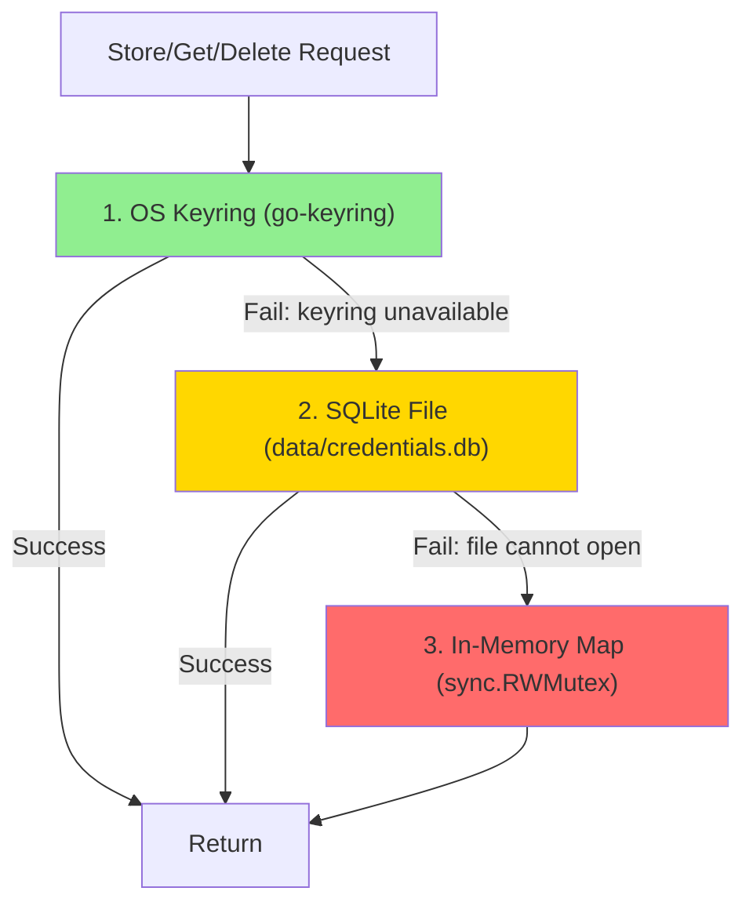
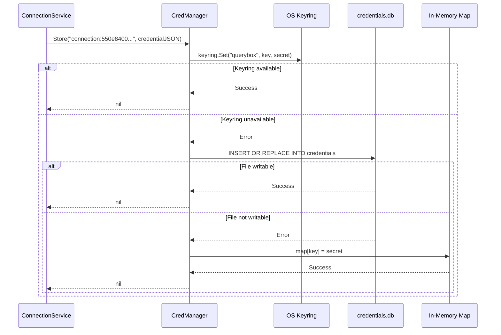
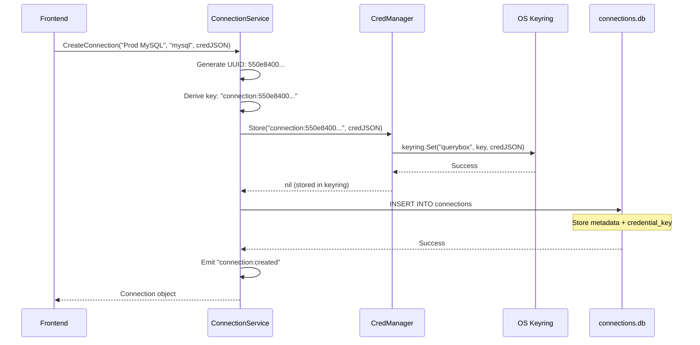

`CredManager` manages secret storage with a 3-tier fallback chain, prioritizing OS-native secure storage when available. It is used exclusively by `ConnectionService` — the frontend never calls CredManager directly.

**Location**: `services/credmanager/credmanager.go`

## Storage Tiers

CredManager attempts storage in this order:



### Tier Comparison

| Tier | Backend | Persistent | Availability |
|------|---------|-----------|-------------|
| 1 | OS Keyring via `go-keyring` | ✓ | macOS Keychain, Windows Credential Manager, Linux Secret Service |
| 2 | `data/credentials.db` (SQLite) | ✓ | Server/CI/headless — OS keyring not available |
| 3 | In-memory `sync.RWMutex` map | ✗ | Last resort; dev/testing only |

<Info>
CredManager stops at the **first tier that succeeds**. It does not sync across tiers if a higher tier becomes available later.
</Info>

## API

CredManager provides a simple interface:

```go
type CredManager interface {
    Store(key, secret string) error
    Get(key string) (string, error)
    Delete(key string) error
}
```

### Store(key, secret string) error

Stores a credential, trying each tier until one succeeds:



**Key format**: `"connection:<uuid>"` (set by ConnectionService)

**Secret format**: Credential JSON string (opaque to CredManager)

### Get(key string) (string, error)

Retrieves a credential, trying each tier until one succeeds:

```go
secret, err := credManager.Get("connection:550e8400-e29b-41d4-a716-446655440000")
if err != nil {
    // Credential not found in any tier
    return err
}
// secret contains the credential JSON
```

<Warning>
If a credential is not found in **any** tier, `Get` returns an error. This can happen if:
- The credential was never stored (bug)
- The keyring was cleared externally
- The SQLite file was deleted
- The application was restarted (in-memory tier cleared)
</Warning>

### Delete(key string) error

Removes a credential from all tiers:

```go
err := credManager.Delete("connection:550e8400-e29b-41d4-a716-446655440000")
// Delete is best-effort on tier 1 (keyring errors are logged but not fatal)
```

<Note>
Delete attempts removal from **all tiers**, not just the first one that succeeds. This ensures cleanup even if credentials migrated between tiers.
</Note>

## Storage Tier Details

### Tier 1: OS Keyring

**Backend**: [`go-keyring`](https://github.com/zalando/go-keyring)

**Platform mapping**:
- **macOS**: Keychain Access (`Security.framework`)
- **Windows**: Credential Manager (`wincred.dll`)
- **Linux**: Secret Service API (`libsecret`/`gnome-keyring`)

**Service name**: `"querybox"`

**Storage call**:
```go
import "github.com/zalando/go-keyring"

err := keyring.Set("querybox", "connection:550e8400...", credentialJSON)
```

**Benefits**:
- Native OS encryption
- Survives app restarts
- User-managed via OS tools
- Supports biometric unlock (macOS Touch ID, Windows Hello)

**Limitations**:
- Not available in headless environments (servers, CI)
- May prompt user for keyring unlock
- Cannot be used in sandboxed environments without entitlements

<Expandable title="Viewing credentials in OS tools">
**macOS Keychain Access**:
1. Open Keychain Access app
2. Search for "querybox"
3. Double-click entry to view details
4. Credentials stored under "Account" = `connection:<uuid>`

**Windows Credential Manager**:
1. Control Panel → User Accounts → Credential Manager
2. Look under "Generic Credentials"
3. Find entries starting with "querybox"

**Linux (GNOME)**:
1. Use `seahorse` (Passwords and Keys app)
2. Search for "querybox"
3. Entries stored in the default keyring
</Expandable>

### Tier 2: SQLite File

**Backend**: SQLite database at `data/credentials.db`

**Schema**:
```sql
CREATE TABLE credentials (
    key TEXT PRIMARY KEY,
    secret TEXT NOT NULL
);
```

**Storage call**:
```go
INSERT OR REPLACE INTO credentials (key, secret) VALUES (?, ?)
```

**Benefits**:
- Works in headless environments
- Portable (file can be backed up)
- No external dependencies

**Limitations**:
- **Secrets stored unencrypted** — restrict filesystem permissions in production
- Requires writable disk
- No OS-level audit trail

<Warning>
Credentials in `data/credentials.db` are stored in **plaintext**. Set appropriate filesystem permissions:

```bash
chmod 600 data/credentials.db  # Owner read/write only
```

Consider encrypting the entire `data/` directory if storing on shared systems.
</Warning>

### Tier 3: In-Memory Map

**Backend**: Go `map[string]string` protected by `sync.RWMutex`

**Storage call**:
```go
mu.Lock()
memoryStore[key] = secret
mu.Unlock()
```

**Benefits**:
- Always available
- No external dependencies
- Fast access

**Limitations**:
- **Ephemeral** — cleared on app restart
- **Not persistent** — credentials must be re-entered after restart
- Memory can be inspected by debuggers

<Note>
The in-memory tier is acceptable for:
- CI test runs where neither keyring nor writable disk is available
- Development with mock credentials
- Temporary connections that won't be reused

**Do not** rely on this tier for production use.
</Note>

## Integration with ConnectionService

CredManager is called by ConnectionService at these points:

| ConnectionService Operation | CredManager Call | When |
|-----------|----------|------|
| `CreateConnection` | `Store(key, secret)` | After generating UUID, before DB insert |
| `GetCredential` | `Get(key)` | When frontend requests credential for plugin exec |
| `DeleteConnection` | `Delete(key)` | Before removing metadata from DB |

### Flow Example: Creating a Connection



<Info>
Credentials are stored **before** metadata. If credential storage fails at all tiers (extremely rare), the connection is not created.
</Info>

## Security Considerations

### Credential Isolation

- Credentials **never** appear in `connections.db`
- Frontend **never** caches credential values
- Plugins receive credentials only during execution
- Credentials are not logged or included in error messages

### Keyring Security

When using OS keyring:

- **macOS**: Protected by FileVault encryption + user keychain password
- **Windows**: Protected by DPAPI (Data Protection API) tied to user account
- **Linux**: Protected by keyring daemon password

<Warning>
On Linux, ensure `gnome-keyring` or `kwallet` is installed and running:

```bash
# Check if Secret Service is available
secret-tool lookup service querybox
```

Without a keyring daemon, CredManager will fall back to SQLite.
</Warning>

### SQLite File Permissions

When falling back to SQLite tier:

1. Set restrictive file permissions immediately after creation:
   ```bash
   chmod 600 data/credentials.db
   ```

2. Consider encrypting the parent directory:
   ```bash
   # macOS encrypted disk image
   hdiutil create -size 100m -encryption -volname QueryBoxData data.dmg
   
   # Linux LUKS
   cryptsetup luksFormat /dev/sdb1
   ```

3. Exclude from backups if credentials should not persist:
   ```bash
   # macOS Time Machine
   tmutil addexclusion data/credentials.db
   ```

### Memory Safety

In-memory tier considerations:

- Credentials stored as Go strings (not zeroed after use)
- Memory can be inspected via debugger or core dump
- Acceptable for development; avoid for production

<Expandable title="Why aren't credentials zeroed from memory?">
Go strings are immutable and managed by the garbage collector. There's no reliable way to zero memory that previously held credential data without disabling GC or using unsafe pointers.

For production deployments:
- Prefer OS keyring tier (credentials never in process memory)
- Run application with core dumps disabled: `ulimit -c 0`
- Use memory-safe deployment environments (containers with no shell access)
</Expandable>

## Troubleshooting

### Credentials Not Persisting After Restart

**Symptom**: Connections exist but credentials are missing after restarting QueryBox.

**Cause**: CredManager fell back to in-memory tier (tier 3).

**Solution**:
1. Check if OS keyring is available (tier 1)
2. Ensure `data/credentials.db` is writable (tier 2)
3. Recreate connections — credentials will be stored in the highest available tier

### Keyring Unlock Prompts (macOS/Linux)

**Symptom**: OS prompts for keyring password on app startup.

**Cause**: Keyring is locked and requires authentication.

**Solution**:
- **macOS**: Unlock Keychain Access or enable "Unlock on Login"
- **Linux**: Start keyring daemon with auto-unlock:
  ```bash
  gnome-keyring-daemon --start --components=secrets
  ```

### Orphaned Credentials

**Symptom**: Credentials exist in keyring but no corresponding connection in UI.

**Cause**: Metadata deletion succeeded but credential deletion failed.

**Solution**:

Manually delete from keyring:

```bash
# macOS
security delete-generic-password -s querybox -a "connection:550e8400..."

# Linux
secret-tool clear service querybox account "connection:550e8400..."

# Windows (PowerShell)
cmdkey /delete:querybox:connection:550e8400...
```

### SQLite File Corruption

**Symptom**: Tier 2 always fails, falling back to tier 3.

**Cause**: `data/credentials.db` is corrupted.

**Solution**:

```bash
# Backup existing file
cp data/credentials.db data/credentials.db.backup

# Attempt repair
sqlite3 data/credentials.db "PRAGMA integrity_check;"

# If repair fails, delete and recreate
rm data/credentials.db
# Restart QueryBox - schema will be auto-created
```

<Warning>
Deleting `credentials.db` will **lose all credentials** stored in tier 2. Connections will still exist but credentials must be re-entered.
</Warning>

## Best Practices

### Development

- Use in-memory tier (tier 3) for mock credentials
- Commit example connection configs without real credentials
- Document which tier is expected in dev environments

### Production

- Prefer OS keyring tier (tier 1) for desktop deployments
- Use encrypted filesystem for SQLite tier (tier 2) in headless environments
- **Never** commit `credentials.db` or keyring exports to version control
- Set restrictive file permissions on `data/` directory:
  ```bash
  chmod 700 data/
  chmod 600 data/credentials.db
  ```

### CI/Testing

- Use in-memory tier or temporary SQLite files
- Set `QUERYBOX_DATA_DIR` to a test-specific path:
  ```bash
  export QUERYBOX_DATA_DIR=/tmp/querybox-test-$CI_JOB_ID
  ```
- Clean up after tests:
  ```bash
  rm -rf /tmp/querybox-test-$CI_JOB_ID
  ```