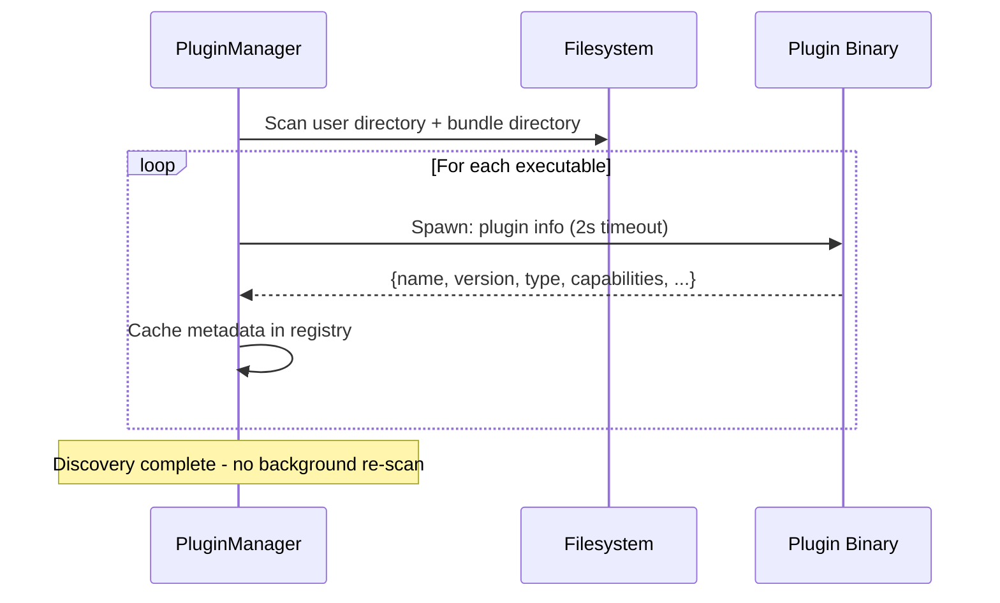

Plugins are single-shot executables that communicate via JSON over stdin/stdout. Any language can implement a plugin — no SDKs or bindings required. The host spawns a subprocess per request, sends input, reads output, and the plugin exits.

## Overview

**Host service**: `services/pluginmgr/pluginmgr.go`  
**Plugin SDK**: `pkg/plugin` (`ServeCLI` helper + protobuf aliases)  
**Proto contract**: `contracts/plugin/v1/plugin.proto` → generated `rpc/contracts/plugin/v1` (`pluginpb`)

<Info>
Plugins run as **isolated subprocesses** with no persistent state. This keeps the system simple and provides strong fault isolation.
</Info>

## CLI Commands

Each plugin implements a command-line interface with these commands:

| Command | Stdin | Stdout | Timeout | Required |
|---------|-------|--------|---------|----------|
| `info` | — | `{name, version, description, type, ...}` | 2s | ✓ |
| `exec` | `{connection, query, options?}` | `{result, error}` | 30s | ✓ |
| `authforms` | — | Auth form definitions | 30s | ✓ |
| `connection-tree` | `{connection}` | `{nodes: [...]}` | 30s | optional |
| `test-connection` | `{connection}` | `{ok: bool, message: string}` | 15s | optional |

### The `info` Command

Returns plugin metadata used for discovery and UI rendering:

```json
{
  "name": "mysql",
  "version": "1.0.0",
  "description": "MySQL / MariaDB driver",
  "type": "DRIVER",
  "url": "https://...",
  "author": "...",
  "license": "MIT",
  "icon_url": "...",
  "capabilities": ["explain-query"],
  "tags": ["sql", "relational"],
  "contact": "...",
  "metadata": {},
  "settings": {}
}
```

<Note>
Hosts ignore unknown fields for forward compatibility. Older plugins emitting a numeric `type` are also accepted.
</Note>

### The `exec` Command

Executes queries and returns structured results. The response contains exactly one result type:

| Field | Type | Use |
|-------|------|-----|
| `sql` | `SqlResult{columns, rows}` | Query results with column names |
| `document` | `DocumentResult{documents}` | JSON document store results |
| `kv` | `KvResult{entries}` | Key-value results (also used as raw-text wrapper) |

<Info>
Plugins that return raw strings are automatically wrapped in `kv` format by the host.
</Info>

#### Example exec request:

```json
{
  "connection": {
    "host": "localhost",
    "port": 3306,
    "username": "root",
    "password": "...",
    "database": "mydb"
  },
  "query": "SELECT * FROM users LIMIT 10",
  "options": {
    "explain-query": "yes"
  }
}
```

#### Example exec response:

```json
{
  "result": {
    "sql": {
      "columns": ["id", "name", "email"],
      "rows": [
        ["1", "Alice", "alice@example.com"],
        ["2", "Bob", "bob@example.com"]
      ]
    }
  }
}
```

### The `authforms` Command

Returns structured form definitions for connection authentication:

```json
{
  "forms": [
    {
      "name": "basic",
      "label": "Standard Connection",
      "fields": [
        {
          "name": "host",
          "label": "Host",
          "type": "text",
          "required": true,
          "default": "localhost"
        },
        {
          "name": "password",
          "label": "Password",
          "type": "password",
          "required": false
        }
      ]
    }
  ]
}
```

<Note>
Plugins that don't implement `authforms` fall back to a single DSN/credential text input.
</Note>

The frontend renders one tab per form. On submit, form values are serialized as JSON and passed to `ConnectionService.CreateConnection`.

### The `connection-tree` Command

Returns hierarchical database structure for browsing:

```json
{
  "nodes": [
    {
      "id": "db:mydb",
      "label": "mydb",
      "type": "database",
      "children": [
        {
          "id": "table:users",
          "label": "users",
          "type": "table",
          "actions": [
            { "label": "Browse Rows", "query": "SELECT * FROM users LIMIT 100" },
            { "label": "Show Schema", "query": "DESCRIBE users" }
          ]
        }
      ],
      "actions": [
        { "label": "Show Tables", "query": "SHOW TABLES" }
      ]
    }
  ]
}
```

When a user activates a node action, the frontend calls `PluginManager.ExecTreeAction(name, conn, actionQuery, options)`, which delegates to `ExecPlugin`.

<Expandable title="Connection tree structure">
Each node represents a database object (database, schema, table, column, etc.) and can:
- Have child nodes for hierarchical browsing
- Provide actions that generate queries
- Include metadata for icon rendering or custom UI

The tree structure is plugin-defined — NoSQL databases might use different hierarchies than relational databases.
</Expandable>

### The `test-connection` Command

Validates connection parameters without persistence:

```json
{
  "connection": {
    "host": "localhost",
    "port": 3306,
    "username": "root",
    "password": "..."
  }
}
```

Response:

```json
{
  "ok": true,
  "message": "Connected successfully"
}
```

<Info>
Test connection uses a **15s timeout** (shorter than the standard 30s) to provide faster feedback during connection setup.
</Info>

## Capabilities

### Explain-Query Capability

Plugins can advertise `"explain-query"` in their `capabilities` array. When present:

1. The host renders an **Explain** button in the result workspace
2. Clicking it reruns the current query with `options: {"explain-query": "yes"}`
3. The plugin interprets the flag (e.g., prepending `EXPLAIN` to SQL)
4. Results are rendered in a separate **Explain** tab

```json
{
  "name": "postgresql",
  "capabilities": ["explain-query"],
  ...
}
```

<Note>
The plugin is responsible for implementing the explain logic. The host only passes the option flag.
</Note>

## Plugin Discovery

QueryBox discovers plugins from two locations:

### Primary: User Directory

User-writable config directory for custom plugins:
- **Linux**: `$XDG_CONFIG_HOME/querybox/plugins`
- **Windows**: `%APPDATA%\querybox\plugins`
- **macOS**: `~/Library/Application Support/querybox/plugins`

On startup, QueryBox copies bundled plugins from `bin/plugins` to this directory, overwriting existing files. This keeps bundled drivers up-to-date while allowing custom plugins.

### Fallback: Bundle Directory

Traditional `bin/plugins` next to the executable:
- Inside `.app` bundles
- Installers
- `wails3 dev` working directory

<Warning>
Plugin discovery happens **once at startup**. Adding, removing, or replacing a plugin binary requires **restarting the application** to take effect.
</Warning>

### Discovery Process



<Info>
`PluginManager.Rescan()` triggers an immediate synchronous re-probe if a manual refresh is needed without a full restart. This is exposed as a button in the Plugins window.
</Info>

## Reference Plugins

QueryBox ships with these reference implementations:

| Plugin | Commands | Capabilities | Notes |
|--------|----------|-------------|-------|
| `mysql` | exec, authforms, connection-tree, test-connection | explain-query | TLS support |
| `postgresql` | exec, authforms, connection-tree, test-connection | explain-query | |
| `sqlite` | exec, authforms, connection-tree, test-connection | explain-query | Two auth forms: local file (`modernc.org/sqlite`) + Turso Cloud (`go-libsql`) |
| `redis` | exec, authforms | — | Two auth forms: basic (host/port/password/db) + URL string |
| `arangodb` | exec, authforms | — | Multi-model (documents, graphs); basic auth form |

## Writing a Plugin

### Quick Start

1. Create `plugins/<name>/main.go` (package `main`)
2. Import `pkg/plugin` and call `plugin.ServeCLI()` in `main()`
3. Implement handler functions for each command
4. Build: `task build:plugins` → binary lands in `bin/plugins/<name>` (`.exe` on Windows)
5. Drop binary into `bin/plugins/` — the host discovers it automatically

### Minimal Example

```go
package main

import (
    "github.com/querybox/querybox/pkg/plugin"
    pluginpb "github.com/querybox/querybox/rpc/contracts/plugin/v1"
)

func main() {
    plugin.ServeCLI(plugin.Handlers{
        Info: func() (*pluginpb.InfoResponse, error) {
            return &pluginpb.InfoResponse{
                Name:        "mydb",
                Version:     "1.0.0",
                Description: "My Database Driver",
                Type:        pluginpb.PluginType_DRIVER,
            }, nil
        },
        Exec: func(req *pluginpb.ExecRequest) (*pluginpb.ExecResponse, error) {
            // Execute query and return results
            return &pluginpb.ExecResponse{
                Result: &pluginpb.ExecResponse_Kv{
                    Kv: &pluginpb.KvResult{
                        Entries: []*pluginpb.KvEntry{
                            {Key: "result", Value: "Hello from plugin"},
                        },
                    },
                },
            }, nil
        },
        AuthForms: func() (*pluginpb.AuthFormsResponse, error) {
            // Return form definitions
            return &pluginpb.AuthFormsResponse{Forms: []*pluginpb.AuthForm{...}}, nil
        },
    })
}
```

<Info>
See `plugins/template/main.go` in the repository for a complete example with all optional fields.
</Info>

## Design Benefits

### Language Agnostic

Any language can implement a plugin:
- Go (reference implementations)
- Python, Node.js, Rust, etc.
- Just read JSON from stdin, write JSON to stdout

### Crash Isolation

Plugin failures are isolated:
- Host never crashes due to plugin bugs
- Failed queries return error responses
- Next execution spawns a fresh process

### Simple Development Workflow

1. Edit plugin code
2. Rebuild binary
3. Restart QueryBox (or click Rescan)
4. Test immediately

No complex build system or hot-reload required.

### No IPC Complexity

Stdin/stdout is the universal interface:
- No sockets or named pipes
- No serialization library dependencies
- Standard JSON everywhere

<Expandable title="Why not use persistent plugins?">
Persistent plugins would require:
- IPC protocol design and versioning
- Connection pooling and lifecycle management
- Crash detection and restart logic
- State synchronization between host and plugin

For typical query workloads (1-30 seconds), subprocess spawn overhead (10-50ms) is negligible. The simplicity and isolation benefits far outweigh the marginal performance cost.
</Expandable>