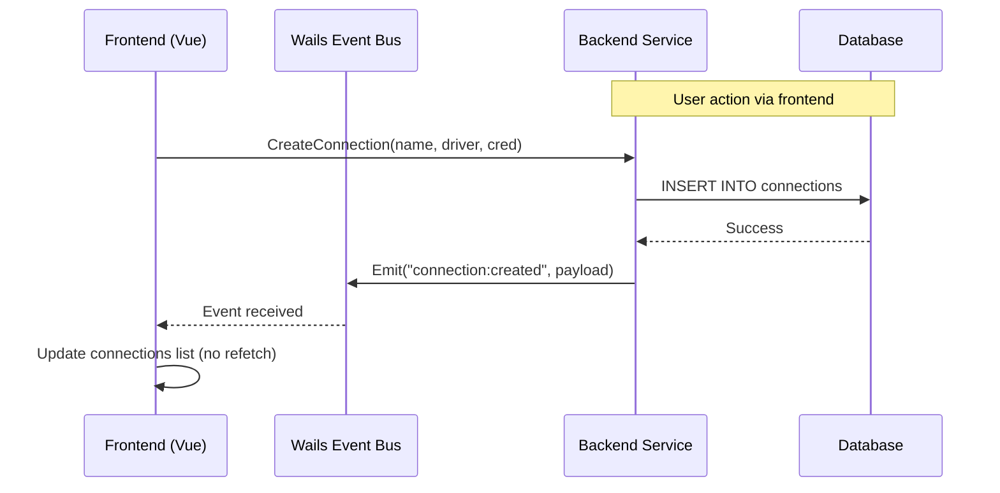
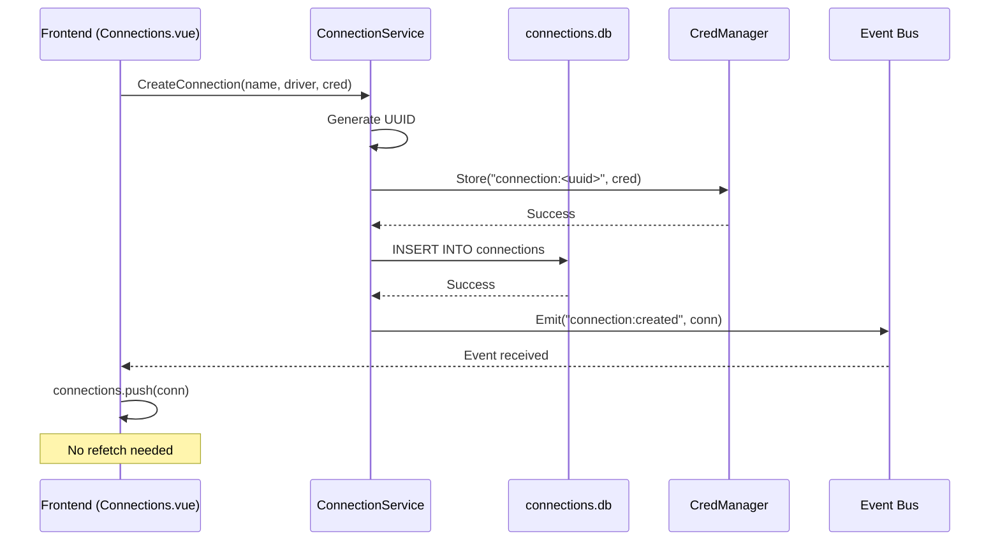
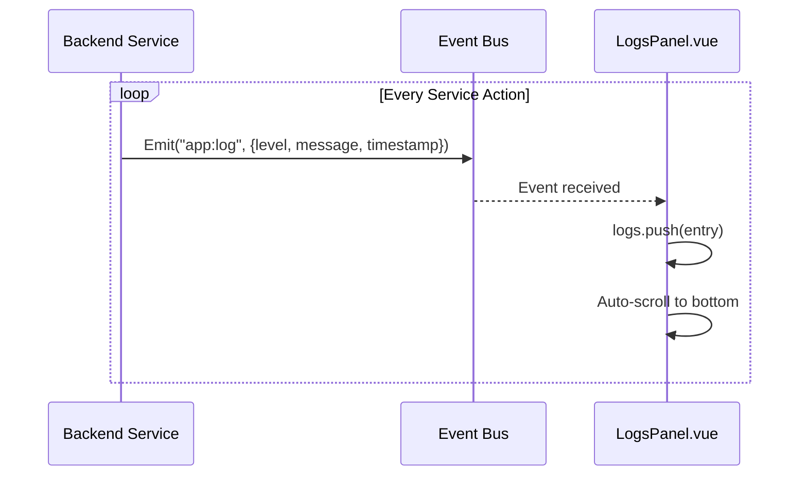

QueryBox uses **unidirectional event flow**: the **Go backend is the sole event producer**, and the **Vue frontend is a pure consumer**. This contract ensures data consistency, eliminates polling, and enables reactive UI updates without explicit refetches.

## Event Architecture



## Event Contract

### Core Principles

1. **Backend is the sole event producer**  
   Go services emit events via `app.Event.Emit()`. Frontend **never** calls `Events.Emit()` for domain topics.

2. **Frontend is a pure consumer**  
   Components subscribe via `Events.On()` and react—no re-fetch RPC needed when the event payload is sufficient.

3. **Events emit after successful DB write**  
   Never emit speculatively. Only emit after state has been persisted.

4. **Event constants declared in Go**  
   All event names defined as `const` in `services/events.go`. TypeScript listeners use the same string literals.

---

## Event Catalog

| Event | Emitted By | Payload Type | When |
|-------|-----------|--------------|------|
| `app:log` | All services | `LogEntry` | Every significant service action |
| `connection:created` | `ConnectionService.CreateConnection` | `ConnectionCreatedEvent` | After successful DB insert |
| `connection:deleted` | `ConnectionService.DeleteConnection` | `ConnectionDeletedEvent` | After successful DB delete |
| `connections-window:closed` | `App.CloseConnectionsWindow` | `bool` | When connections window is hidden |
| `menu:logs-toggled` | Native menu (macOS) | `nil` | User selects "Toggle Logs" menu item |
| `plugins:ready` | `PluginManager` (async scan) | `nil` | Initial plugin scan completes |

**Note**: `app:log` is a **stream channel**, not a state-change event—it does not follow the past-tense verb rule.

---

## Event Definitions

### app:log

**Constant**: `services.EventAppLog = "app:log"`  
**Emitted By**: All services (ConnectionService, PluginManager, etc.)  
**Purpose**: Stream structured log entries to the frontend

**Payload** (`services/events.go:42`):
```go
type LogEntry struct {
    Level     LogLevel `json:"level"`      // "info", "warn", "error"
    Message   string   `json:"message"`    // Human-readable log message
    Timestamp string   `json:"timestamp"`  // RFC3339Nano UTC
}
```

**Frontend Subscription** (`views/Home.vue:115`):
```javascript
import { Events } from '@wailsio/runtime'

Events.On('app:log', (event) => {
  const entry = event.data
  logs.value.push(entry)
})
```

**Example Messages**:
```
CreateConnection: creating 'db1' (driver: mysql)
CreateConnection: 'db1' created successfully (id: abc123)
ExecPlugin: executing (driver: mysql, query: "SELECT * FROM users")
ExecPlugin: (driver: mysql) completed successfully
```

See [Log Message Naming Rules](#log-message-naming-rules) below.

---

### connection:created

**Constant**: `services.EventConnectionCreated = "connection:created"`  
**Emitted By**: `ConnectionService.CreateConnection` (`connection.go:261`)  
**Purpose**: Notify frontend that a new connection was persisted

**Payload** (`services/events.go:49`):
```go
type ConnectionCreatedEvent struct {
    Connection Connection `json:"connection"`
}
```

**Emission** (`connection.go:261`):
```go
emitConnectionCreated(s.app, conn)
```

**Frontend Handler** (example from `Connections.vue`):
```javascript
Events.On('connection:created', (event) => {
  const conn = event.data.connection
  connections.value.push(conn)  // Add to list immediately, no refetch
})
```

**Why This Matters**: Frontend avoids redundant `ListConnections()` call after creating a connection.

---

### connection:deleted

**Constant**: `services.EventConnectionDeleted = "connection:deleted"`  
**Emitted By**: `ConnectionService.DeleteConnection` (`connection.go:327`)  
**Purpose**: Notify frontend that a connection was removed

**Payload** (`services/events.go:54`):
```go
type ConnectionDeletedEvent struct {
    ID string `json:"id"`  // UUID of deleted connection
}
```

**Emission** (`connection.go:327`):
```go
emitConnectionDeleted(s.app, id)
```

**Frontend Handler**:
```javascript
Events.On('connection:deleted', (event) => {
  const id = event.data.id
  connections.value = connections.value.filter(c => c.id !== id)
})
```

---

### menu:logs-toggled

**Constant**: `services.EventMenuLogsToggled = "menu:logs-toggled"`  
**Emitted By**: Native application menu (macOS only, `services/menu.go`)  
**Purpose**: Request frontend toggle the logs panel

**Payload**: `nil`

**Frontend Handler** (`views/Home.vue:122`):
```javascript
Events.On('menu:logs-toggled', () => toggleFooter())
```

**Why This Pattern**: Native menus can't directly call Vue methods. Event bridges the gap.

---

### plugins:ready

**Constant**: `services.EventPluginsReady = "plugins:ready"`  
**Emitted By**: `PluginManager` (after async scan completes, `pluginmgr.go:257`)  
**Purpose**: Signal frontend that `ListPlugins()` is now populated

**Payload**: `nil`

**Emission** (`pluginmgr.go:249`):
```go
func (m *Manager) emitPluginsReady() {
    select {
    case <-m.appReadyCh:  // Wait for SetApp() to provide app reference
        m.app.Event.Emit(services.EventPluginsReady, nil)
    case <-time.After(10 * time.Second):
        return  // Give up if SetApp is never called
    }
}
```

**Frontend Handler** (example from `Plugins.vue`):
```javascript
Events.On('plugins:ready', async () => {
  plugins.value = await ListPlugins()  // Reload plugin list
})
```

**Why This Matters**: Plugin scan runs asynchronously at startup. Without this event, frontend would need to poll or show stale data.

---

## Naming Conventions

### Backend Event Names

**Format**: `<domain>:<past-tense-verb>`

| Rule | Correct | Wrong |
|------|---------|-------|
| Lowercase only | `connection:created` | `Connection:Created` |
| Colon separator | `plugin:scanned` | `plugin.scanned` |
| Domain is singular noun | `connection:deleted` | `connections:deleted` |
| Verb is past tense for state changes | `connection:created` | `connection:create` |
| Declared as Go `const` | ✓ | Inline string literals |

**Exception**: Stream channels like `app:log` use present tense (they don't represent state changes).

**Declaration** (`services/events.go:12`):
```go
const (
    EventAppLog              = "app:log"
    EventConnectionCreated   = "connection:created"
    EventConnectionDeleted   = "connection:deleted"
    EventMenuLogsToggled     = "menu:logs-toggled"
    EventConnectionsWindowClosed = "connections-window:closed"
    EventPluginsReady        = "plugins:ready"
)
```

---

### Log Message Naming Rules

**Format**: `"<MethodName>: <lowercase description>"`

| Rule | Correct | Wrong |
|------|---------|-------|
| Method name is PascalCase | `"CreateConnection: ..."` | `"create_connection: ..."` |
| Description starts lowercase | `"CreateConnection: creating 'db1'"` | `"CreateConnection: Creating 'db1'"` |
| No trailing period | `"connection deleted"` | `"connection deleted."` |
| Single-quoted identifiers | `"creating 'my-db'"` | `"creating my-db"` |
| KV context in parentheses | `"(driver: mysql, id: abc)"` | `"[driver=mysql]"` |

**Lifecycle Templates**:

```go
// Start of operation
"CreateConnection: creating 'db1' (driver: mysql)"

// Success
"CreateConnection: 'db1' created successfully (id: abc123)"
"ListConnections: found 3 connection(s)"

// Error
"CreateConnection: failed to store credential for 'db1': permission denied"
"GetCredential: connection 'xyz' not found: sql: no rows in result set"
```

**Implementation Examples**:

```go
// services/connection.go:240
emitLog(s.app, LogLevelInfo, fmt.Sprintf("CreateConnection: creating '%s' (driver: %s)", name, driverType))

// services/connection.go:252
emitLog(s.app, LogLevelInfo, fmt.Sprintf("CreateConnection: '%s' created successfully (id: %s)", name, id))

// services/pluginmgr/pluginmgr.go:497
m.emitLog(services.LogLevelInfo, fmt.Sprintf("ExecPlugin: executing (driver: %s, query: %q)", name, logQuery))
```

---

### Log Levels

| Level | When | Examples |
|-------|------|----------|
| `info` | Normal lifecycle: start, success, counts | `"CreateConnection: creating 'db1'"` |
| `warn` | Recoverable: fallback triggered, optional resource missing | `"OS keyring unavailable, falling back to SQLite"` |
| `error` | Non-recoverable: DB failure, credential loss, plugin crash | `"CreateConnection: failed to store credential"` |

**Type Definition** (`services/events.go:34`):
```go
type LogLevel string

const (
    LogLevelInfo  LogLevel = "info"
    LogLevelWarn  LogLevel = "warn"
    LogLevelError LogLevel = "error"
)
```

---

### Vue Component Emits

**Format**: `kebab-case`

| Rule | Correct | Wrong |
|------|---------|-------|
| Kebab-case | `"tab-closed"` | `"tabClosed"` |
| Past tense for notifications | `"connection-selected"` | `"select-connection"` |
| Noun phrase for data delivery | `"query-result"` | `"send-query-result"` |
| Imperative only for parent requests | `"toggle-logs"` | — |
| Never use backend event names | ✓ | `emit("connection:created")` |

**Example** (`components/WorkspacePanel.vue`):
```javascript
const emit = defineEmits(['tab-closed', 'refresh-tab'])

function closeTab(tabKey) {
  emit('tab-closed', tabKey)
}
```

---

## Event Emission Helpers

### Nil-Safe Pattern

All event emission helpers check if `app` is nil before emitting. This keeps services testable without Wails.

**Implementation** (`services/events.go:60`):
```go
func emitLog(app *application.App, level LogLevel, message string) {
    if app == nil {
        return  // No-op in tests
    }
    app.Event.Emit(EventAppLog, LogEntry{
        Level:     level,
        Message:   message,
        Timestamp: time.Now().UTC().Format(time.RFC3339Nano),
    })
}
```

**Usage** (`services/connection.go:183`):
```go
emitLog(s.app, LogLevelInfo, fmt.Sprintf("ListConnections: found %d connection(s)", len(out)))
```

**Why This Matters**: Services can be constructed and tested without `SetApp()` being called.

---

### Domain Event Helpers

**ConnectionCreatedEvent** (`services/events.go:72`):
```go
func emitConnectionCreated(app *application.App, conn Connection) {
    if app == nil {
        return
    }
    app.Event.Emit(EventConnectionCreated, ConnectionCreatedEvent{Connection: conn})
}
```

**ConnectionDeletedEvent** (`services/events.go:80`):
```go
func emitConnectionDeleted(app *application.App, id string) {
    if app == nil {
        return
    }
    app.Event.Emit(EventConnectionDeleted, ConnectionDeletedEvent{ID: id})
}
```

---

## Frontend Event Patterns

### Subscription Lifecycle

**Pattern**: Subscribe in `onMounted`, unsubscribe in `onUnmounted`

```javascript
import { Events } from '@wailsio/runtime'
import { onMounted, onUnmounted, ref } from 'vue'

const logs = ref([])
let offAppLog = null

onMounted(() => {
  offAppLog = Events.On('app:log', (event) => {
    logs.value.push(event.data)
  })
})

onUnmounted(() => {
  if (offAppLog) {
    offAppLog()  // Critical: prevents memory leaks
  }
})
```

**Why This Matters**: Prevents event listener accumulation on component remounts.

---

### Reactive State Updates

**Anti-Pattern** (polling):
```javascript
// ❌ Don't do this
await CreateConnection(name, driver, cred)
connections.value = await ListConnections()  // Redundant refetch
```

**Correct Pattern** (event-driven):
```javascript
// ✓ Do this
Events.On('connection:created', (event) => {
  connections.value.push(event.data.connection)  // Instant update
})

await CreateConnection(name, driver, cred)
// UI already updated via event—no refetch needed
```

**Benefits**:
- No stale data (backend is source of truth)
- No race conditions (event guarantees DB write completed)
- Faster UI updates (no round-trip latency)

---

## Adding a New Event

### Backend Checklist

1. **Add constant** in `services/events.go` with doc comment
   ```go
   // EventQueryExecuted is emitted after a query executes successfully.
   const EventQueryExecuted = "query:executed"
   ```

2. **Add payload struct** (if needed)
   ```go
   type QueryExecutedEvent struct {
       ConnectionID string `json:"connection_id"`
       Query        string `json:"query"`
       RowCount     int    `json:"row_count"`
   }
   ```

3. **Add emission helper** following nil-safe pattern
   ```go
   func emitQueryExecuted(app *application.App, connID, query string, rowCount int) {
       if app == nil {
           return
       }
       app.Event.Emit(EventQueryExecuted, QueryExecutedEvent{
           ConnectionID: connID,
           Query:        query,
           RowCount:     rowCount,
       })
   }
   ```

4. **Call helper after DB write succeeds**
   ```go
   func (m *Manager) ExecuteQuery(...) {
       // ... execute query ...
       emitQueryExecuted(m.app, connID, query, len(rows))
   }
   ```

5. **Register event type** in `main.go` (for TypeScript bindings)
   ```go
   application.RegisterEvent[services.QueryExecutedEvent]("query:executed")
   ```

6. **Update Event Catalog** in this document

### Frontend Checklist

1. **Subscribe to event** in relevant component
   ```javascript
   import { Events } from '@wailsio/runtime'

   Events.On('query:executed', (event) => {
     const { connection_id, query, row_count } = event.data
     console.log(`Query executed: ${row_count} rows`)
   })
   ```

2. **Unsubscribe on unmount**
   ```javascript
   const off = Events.On('query:executed', handler)
   onUnmounted(() => off())
   ```

---

## Event Flow Diagrams

### Connection Creation Flow



### Log Streaming Flow



---

## Debugging Events

### Backend Logging

All event emissions are logged at `info` level:

```go
emitLog(s.app, LogLevelInfo, "CreateConnection: 'db1' created successfully (id: abc123)")
emitConnectionCreated(s.app, conn)  // Emits connection:created
```

Check the **Logs Panel** in the UI to see event emission timestamps.

### Frontend Console

Log all received events:

```javascript
Events.On('*', (event) => {
  console.log('Event received:', event.name, event.data)
})
```

**Note**: `'*'` wildcard may not be supported in all Wails versions. Use specific event names instead.

### Event Inspector (Future)

Consider adding a debug panel that lists:
- All registered events
- Emission timestamps
- Payload inspection

---

## Performance Considerations

### Event Payload Size

Keep payloads minimal. For large datasets, prefer:

```go
// ❌ Don't emit entire result set
app.Event.Emit("query:executed", ExecResponse{...})  // Could be MBs

// ✓ Emit summary, let frontend fetch details
app.Event.Emit("query:executed", QueryExecutedEvent{
    ConnectionID: id,
    RowCount:     len(rows),
})
```

### Event Throttling

For high-frequency events (e.g., progress updates), throttle on frontend:

```javascript
import { throttle } from 'lodash-es'

const handleProgress = throttle((event) => {
  progress.value = event.data.percent
}, 100)  // Max 10 updates/sec

Events.On('query:progress', handleProgress)
```

---

## Security Considerations

### No Credentials in Events

**Never** emit credential data in events:

```go
// ❌ NEVER do this
emitConnectionCreated(s.app, Connection{
    Credential: credential,  // Exposes secrets to frontend logs!
})

// ✓ Only emit credential_key (reference)
emitConnectionCreated(s.app, Connection{
    CredentialKey: "connection:abc123",  // Safe
})
```

### Log Sanitization

Avoid logging sensitive data:

```go
// ❌ Don't log raw credentials
emitLog(s.app, LogLevelInfo, fmt.Sprintf("Credential: %s", cred))

// ✓ Log only metadata
emitLog(s.app, LogLevelInfo, fmt.Sprintf("CreateConnection: creating '%s' (driver: %s)", name, driver))
```

---

## Next Steps

- [System Architecture Overview](./overview) - High-level system design
- [Core Services](./services) - Backend service API documentation
- [Frontend Architecture](./frontend) - Vue 3 component structure
