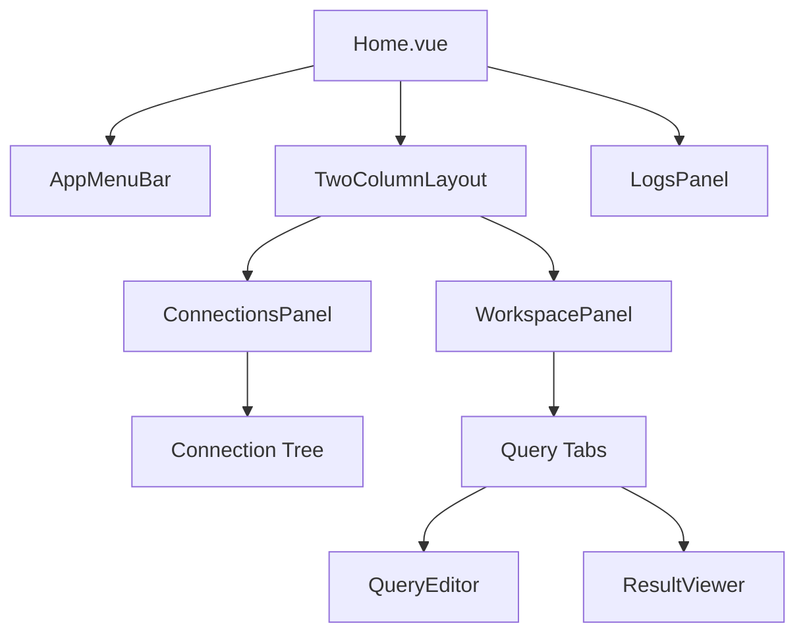
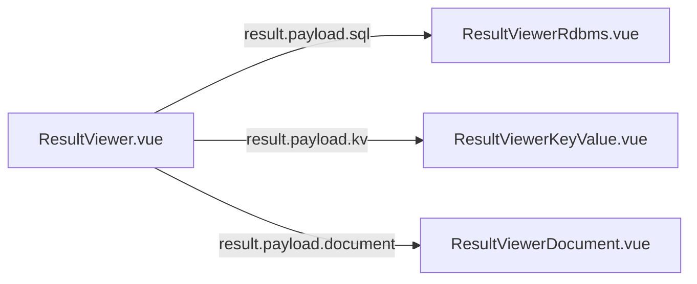

QueryBox's frontend is built with **Vue 3** (Composition API), **Naive UI** components, and **Tailwind CSS**. The architecture emphasizes reactive state management, composable utilities, and event-driven communication with the Go backend.

## Technology Stack

| Technology | Purpose | Version |
|------------|---------|--------|
| **Vue 3** | Reactive UI framework | Latest (Composition API) |
| **Naive UI** | Component library | Latest |
| **Tailwind CSS** | Utility-first styling | Latest |
| **Vue Router** | Client-side routing | Latest (Hash mode) |
| **TypeScript** | Type safety for composables | Latest |
| **Vite** | Build tool | Latest |
| **Wails Runtime** | Go ↔ JS bridge | v3 |

## Application Structure

```
frontend/src/
├── main.js                 # App entry point, router setup
├── App.vue                 # Root component (Naive UI providers)
├── styles/
│   └── tailwind.css        # Tailwind imports
├── views/
│   ├── Home.vue            # Main query interface
│   ├── Connections.vue     # Connection management window
│   └── Plugins.vue         # Plugin listing window
├── components/
│   ├── AppMenuBar.vue      # Menu bar (Windows/Linux only)
│   ├── ConnectionsPanel.vue # Left sidebar (connection tree)
│   ├── WorkspacePanel.vue  # Tab-based query workspace
│   ├── QueryEditor.vue     # SQL/query input editor
│   ├── ResultViewer.vue    # Multi-format result renderer
│   ├── ResultViewerRdbms.vue   # Table grid for SQL results
│   ├── ResultViewerKeyValue.vue # KV pair renderer
│   ├── ResultViewerDocument.vue # JSON/document renderer
│   ├── LogsPanel.vue       # Event log stream
│   ├── TwoColumnLayout.vue # Resizable 2-column container
│   ├── SafeZone.vue        # macOS drag zone wrapper
│   ├── AuthFormRenderer.vue # Dynamic form generator
│   └── ActionFormModal.vue # Tree action prompt modal
├── composables/
│   ├── useResize.ts        # Resizable panel logic
│   └── useConnectionTree.ts # Connection tree cache
└── lib/
    └── icons.js            # Lucide icon exports
```

## Component Architecture

### View Components

#### Home.vue
**Location**: `views/Home.vue`  
**Route**: `/`  
**Window**: Main window

The primary query interface. Composed of:



**Key Features**:
- **Resizable Layout**: 2-column + footer with draggable dividers
- **Event Listeners**: Subscribes to `app:log` and `menu:logs-toggled`
- **State Management**: Connection selection, active tabs, log entries

**State Variables** (`views/Home.vue:24`):
```javascript
const selectedConnection = ref(null)       // Currently selected connection
const activeConnectionId = ref(null)       // Connection ID for workspace tabs
const footerCollapsed = ref(true)          // Logs panel collapsed state
const footerHeight = ref(176)              // Logs panel height (px)
const logs = ref([])                       // Streamed log entries from backend
const leftWidth = ref(0)                   // Left panel width (px)
```

**Implementation**: `views/Home.vue`

---

#### Connections.vue
**Location**: `views/Connections.vue`  
**Route**: `/connections`  
**Window**: Connections window (secondary)

Manages connection CRUD operations:
- List all connections
- Create new connection (dynamic auth forms)
- Test connection (before saving)
- Delete connection

**Event Handling**:
- Listens for `connection:created` → Adds to list without refetch
- Listens for `connection:deleted` → Removes from list

---

#### Plugins.vue
**Location**: `views/Plugins.vue`  
**Route**: `/plugins`  
**Window**: Plugins window (secondary)

Displays discovered plugins with metadata:
- Plugin name, version, description
- Author, license, capabilities
- Error state if probe failed

**Event Handling**:
- Listens for `plugins:ready` → Reloads list when scan completes

---

### Core Components

#### ConnectionsPanel
**Location**: `components/ConnectionsPanel.vue`  
**Purpose**: Left sidebar with connection tree

**Features**:
- List all saved connections
- Expand connection → Fetch tree via `GetConnectionTree()`
- Right-click node → Context menu with actions
- Execute tree action → Calls `ExecTreeAction()`

**State Management**:
```javascript
const connections = ref([])               // From ListConnections()
const expandedKeys = ref([])              // Tree nodes currently expanded
const treeData = ref([])                  // Hierarchical tree structure
```

**Tree Node Structure** (normalized from protobuf):
```javascript
{
  label: 'users',                         // Display name
  node_type: 'table',                     // Enum: database, table, column, etc.
  children: [...],                        // Recursive children
  actions: [                              // Context menu actions
    { label: 'SELECT *', query: 'SELECT * FROM users LIMIT 100' }
  ]
}
```

**Implementation**: `components/ConnectionsPanel.vue`

---

#### WorkspacePanel
**Location**: `components/WorkspacePanel.vue`  
**Purpose**: Tab-based query workspace

**Features**:
- **Welcome Tab**: Shown when no tabs open
- **Query Tabs**: One per query execution
- **Tab Management**: Close, switch, reorder
- **Refresh Tab**: Re-run query (for tree actions with "refresh" support)

**Tab Structure**:
```javascript
{
  key: 'tab-1234',                        // Unique tab ID
  title: 'SELECT * FROM users',           // Display title
  result: { ... },                        // ExecResponse from plugin
  error: 'syntax error',                  // Error message (if any)
  version: 1,                             // Incremented on refresh
  context: {                              // Metadata for refresh
    conn: { ... },                        // Connection object
    action: { ... },                      // Tree action object
    node: { ... }                         // Tree node object
  }
}
```

**Exposed Methods** (`views/Home.vue:57`):
```javascript
workspaceRef.value?.openTab(title, result, error, tabKey, version, context)
```

**Implementation**: `components/WorkspacePanel.vue`

---

#### QueryEditor
**Location**: `components/QueryEditor.vue`  
**Purpose**: SQL/query input editor

**Features**:
- Syntax highlighting (via `<textarea>` with manual styling)
- Execute query (Cmd/Ctrl+Enter)
- Query history (future)
- Autocomplete (future, using `useConnectionTree` composable)

**Props**:
```javascript
defineProps({
  modelValue: String,                     // Query text (v-model)
  disabled: Boolean                       // Disable during execution
})
```

**Implementation**: `components/QueryEditor.vue`

---

#### ResultViewer
**Location**: `components/ResultViewer.vue`  
**Purpose**: Multi-format result renderer

**Architecture**:


**Props**:
```javascript
defineProps({
  result: Object,                         // ExecResponse from plugin
  error: String                           // Error message (if any)
})
```

**Result Type Detection** (protobuf oneof):
```javascript
if (result?.result?.sql) {
  // Render as table grid
} else if (result?.result?.kv) {
  // Render as key-value pairs
} else if (result?.result?.document) {
  // Render as JSON tree
}
```

**Implementation**: `components/ResultViewer.vue`

---

#### ResultViewerRdbms
**Location**: `components/ResultViewerRdbms.vue`  
**Purpose**: Table grid for SQL results

**Features**:
- Scrollable table with fixed header
- Cell copy on click
- NULL value rendering
- Export to CSV (future)

**Data Structure**:
```javascript
result.result.sql = {
  columns: ['id', 'name', 'email'],
  rows: [
    ['1', 'Alice', 'alice@example.com'],
    ['2', 'Bob', 'bob@example.com']
  ]
}
```

**Implementation**: `components/ResultViewerRdbms.vue`

---

#### LogsPanel
**Location**: `components/LogsPanel.vue`  
**Purpose**: Event log stream

**Features**:
- Real-time log streaming via `app:log` event
- Log levels: `info`, `warn`, `error`
- Clear logs button
- Auto-scroll to bottom

**Log Entry Structure** (`services/events.go:42`):
```javascript
{
  level: 'info',                          // LogLevel enum
  message: 'CreateConnection: creating \'db1\' (driver: mysql)',
  timestamp: '2026-03-01T12:34:56.789Z'   // RFC3339Nano UTC
}
```

**Event Subscription** (`views/Home.vue:115`):
```javascript
Events.On('app:log', (event) => {
  const entry = event?.data ?? event
  logs.value.push(entry)
})
```

**Implementation**: `components/LogsPanel.vue`

---

#### TwoColumnLayout
**Location**: `components/TwoColumnLayout.vue`  
**Purpose**: Resizable 2-column container

**Props**:
```javascript
defineProps({
  leftWidth: Number                       // Left column width (px)
})
```

**Events**:
```javascript
emit('dragstart', event)                  // User starts dragging divider
```

**Implementation**: `components/TwoColumnLayout.vue`

Paired with `useResize` composable for drag handling.

---

#### AuthFormRenderer
**Location**: `components/AuthFormRenderer.vue`  
**Purpose**: Dynamic form generator for plugin auth forms

**Features**:
- Render form fields from `GetPluginAuthForms()` response
- Field types: `text`, `password`, `number`, `file`
- Validation (required fields)
- File picker integration (for SQLite file paths)

**Props**:
```javascript
defineProps({
  form: Object,                           // AuthForm from plugin
  modelValue: Object                      // Form data (v-model)
})
```

**Form Data Structure**:
```javascript
{
  host: 'localhost',
  port: 5432,
  user: 'admin',
  password: 'secret'
}
```

**Implementation**: `components/AuthFormRenderer.vue`

---

### Layout Components

#### SafeZone
**Location**: `components/SafeZone.vue`  
**Purpose**: macOS drag zone wrapper

Wraps content in a non-draggable zone when `data-wails-drag` is set on parent.

**Implementation**: `components/SafeZone.vue`

---

## Composables

### useResize
**Location**: `composables/useResize.ts`  
**Purpose**: Resizable panel drag logic

**Exports**:
```typescript
createHorizontalResizer({ containerRef, sizeRef, min, minOther })
createVerticalResizer({ sizeRef, min, getMax })
```

**Usage** (`views/Home.vue:39`):
```javascript
const horizontalResizer = createHorizontalResizer({
  containerRef,                           // Container element ref
  sizeRef: leftWidth,                     // Reactive size ref
  min: 250,                               // Min left width
  minOther: 200                           // Min right width
})

function startDrag(e) {
  horizontalResizer.start(e)              // Attach move/up listeners
}

onUnmounted(() => {
  horizontalResizer.destroy()             // Cleanup listeners
})
```

**Implementation**: `composables/useResize.ts`

---

### useConnectionTree
**Location**: `composables/useConnectionTree.ts`  
**Purpose**: Connection tree cache and client-side completion

**Exports**:
```typescript
useConnectionTree(connRef?: Ref<Connection | null>)
```

**Returns**:
```typescript
{
  nodes: Ref<TreeNode[]>,                 // Cached tree nodes
  load: (conn) => Promise<void>,          // Manually load tree
  getTableNames: () => string[],          // Extract table names
  getColumns: (table) => string[],        // Extract column names
  cache: Record<string, TreeNode[]>       // Global cache (reactive)
}
```

**Usage** (`components/ConnectionsPanel.vue`):
```javascript
const { nodes, load } = useConnectionTree()

await load(connection)                    // Fetch tree from backend
const tables = getTableNames()            // ['users', 'posts', 'comments']
const cols = getColumns('users')          // ['id', 'name', 'email']
```

**Caching Strategy**:
- Global reactive map: `Record<connectionId, TreeNode[]>`
- Fetch on first access, reuse thereafter
- Cache shared across all components
- No automatic invalidation (requires app restart or manual rescan)

**Node Normalization**:
Converts protobuf enum `node_type` (number) to lowercase string:

```typescript
const NODE_TYPE_ENUM_MAP = {
  1: 'database',
  2: 'table',
  3: 'column',
  4: 'schema',
  5: 'view',
  6: 'action',
  7: 'collection',
  8: 'key'
}
```

**Implementation**: `composables/useConnectionTree.ts`

---

## State Management

### No Global Store
QueryBox **does not use Vuex or Pinia**. State is managed via:

1. **Component-local state**: `ref()` and `reactive()` within components
2. **Event-driven updates**: Backend events update UI state
3. **Composable caches**: Shared state via composables (e.g., `useConnectionTree`)

### Event-Driven Updates

**Backend → Frontend** (no polling, no refetching):

```javascript
// Listen for connection creation
Events.On('connection:created', (event) => {
  const conn = event.data.connection
  connections.value.push(conn)            // Add to list immediately
})

// Listen for connection deletion
Events.On('connection:deleted', (event) => {
  const id = event.data.id
  connections.value = connections.value.filter(c => c.id !== id)
})
```

**Benefits**:
- No stale data (backend is source of truth)
- No redundant API calls
- Instant UI updates

See [Event System documentation](./event-system) for full event catalog.

---

## Routing

**Router Mode**: Hash (`/#/connections`)  
**Reason**: Works without server-side routing

**Routes** (`main.js:33`):
```javascript
const routes = [
  { path: '/',            component: Home },
  { path: '/connections', component: Connections },
  { path: '/plugins',     component: Plugins }
]
```

**Window Mapping**:
- **Main window** (`main`): Displays `/` (Home)
- **Connections window** (`connections`): Displays `/connections`
- **Plugins window** (`plugins`): Displays `/plugins`

Each window is a separate webview, but shares the same frontend bundle.

---

## Styling

### Tailwind CSS
**Config**: `frontend/tailwind.config.js`  
**Imports**: `frontend/src/styles/tailwind.css`

**Utility Classes**:
```html
<div class="flex flex-col h-screen bg-white">
  <div class="flex-1 min-h-0 overflow-hidden">
    <!-- Flexbox layout with overflow control -->
  </div>
</div>
```

### Naive UI Theme
**Config**: `App.vue:7`

```javascript
const themeOverrides = {
  common: {
    fontFamily: '"JetBrains Mono", ui-monospace, monospace',
    fontFamilyMono: '"JetBrains Mono", ui-monospace, monospace'
  }
}
```

Enforces **JetBrains Mono** across all Naive UI components for a developer-tool aesthetic.

---

## Wails Integration

### Auto-Generated Bindings

Wails generates TypeScript bindings from Go service methods:

**Go Service** (`services/connection.go:177`):
```go
func (s *ConnectionService) ListConnections(ctx context.Context) ([]Connection, error)
```

**Generated Binding** (`bindings/.../connectionservice.js`):
```javascript
export function ListConnections() {
  return window.wails.Call.ByName('ConnectionService.ListConnections')
}
```

**Frontend Import**:
```javascript
import { ListConnections } from '@/bindings/github.com/felixdotgo/querybox/services/connectionservice'

const connections = await ListConnections()
```

### Event System

**Subscribe to Events** (`views/Home.vue:115`):
```javascript
import { Events } from '@wailsio/runtime'

const offAppLog = Events.On('app:log', (event) => {
  const entry = event.data
  logs.value.push(entry)
})

onUnmounted(() => {
  offAppLog()                             // Unsubscribe on component unmount
})
```

**Event Registration** (backend, `main.go:30`):
```go
application.RegisterEvent[services.LogEntry]("app:log")
```

Wails generates strongly-typed event definitions for TypeScript.

---

## Build Process

### Development
```bash
wails dev
```

Runs Vite dev server + Go backend. Hot reload enabled.

### Production
```bash
wails build
```

Outputs:
- **macOS**: `build/bin/QueryBox.app`
- **Windows**: `build/bin/querybox.exe`
- **Linux**: `build/bin/querybox`

Frontend assets embedded via `//go:embed all:frontend/dist` (`main.go:20`).

---

## Platform-Specific UI

### macOS
- **No menu bar component**: Uses native application menu
- **Translucent backdrop**: Blurred window background
- **Title bar**: Hidden inset style (50px drag zone)

### Windows / Linux
- **AppMenuBar component**: Rendered menu bar (`components/AppMenuBar.vue`)
- **Standard title bar**: OS-native window chrome

**Conditional Rendering** (`views/Home.vue:142`):
```html
<AppMenuBar v-if="!isMac" ref="menuBarRef" @toggle-logs="toggleFooter" />
```

---

## Performance Considerations

### Lazy Window Creation

**Strategy** (`main.go:78`):
```go
go func() {
    time.Sleep(time.Second * 1)           // Delay 1 second
    app.ConnectionsWindow = app.NewConnectionsWindow()
    app.PluginsWindow = app.NewPluginsWindow()
}()
```

**Reason**: Reduces initial load time. Main window appears faster.

### Tree Caching

Connection trees are fetched **once** and cached globally (`useConnectionTree`):

```typescript
const treeCache: Record<string, TreeNode[]> = reactive({})

if (treeCache[conn.id]) {
  return                                  // Skip fetch if already loaded
}
```

**Invalidation**: Requires app restart (no automatic sync).

### Event Cleanup

**Pattern**:
```javascript
const offAppLog = Events.On('app:log', handler)

onUnmounted(() => {
  offAppLog()                             // Prevent memory leaks
})
```

**Critical**: Prevents event listener accumulation on component remounts.

---

## Next Steps

- [System Architecture Overview](./overview) - High-level system design
- [Core Services](./services) - Backend API documentation
- [Event System](./event-system) - Event contracts and patterns
