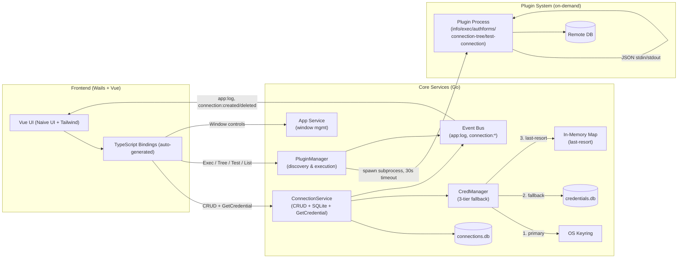

QueryBox is a lightweight database management tool built with **Wails v3** (Go backend) and **Vue 3** (frontend). The architecture follows a clean separation between the desktop application layer, core services, and an on-demand plugin system.

## System Architecture

The system is composed of three primary layers:



## Core Components

| Component | Location | Wails-bound | Responsibility |
|-----------|----------|-------------|----------------|
| **App Service** | `services/app.go` | ✓ | Window lifecycle (maximize, minimize, fullscreen, close) |
| **ConnectionService** | `services/connection.go` | ✓ | Connection CRUD, credential delegation, event emission |
| **PluginManager** | `services/pluginmgr/pluginmgr.go` | ✓ | Plugin discovery, registry, on-demand execution |
| **CredManager** | `services/credmanager/credmanager.go` | ✗ | Secure secret storage with 3-tier fallback |

## Technology Stack

### Backend (Go)
- **Framework**: Wails v3 (native desktop wrapper)
- **Database**: SQLite (modernc.org/sqlite) for connections & credential fallback
- **Keyring**: zalando/go-keyring for OS-native credential storage
- **IPC**: Protobuf JSON for plugin communication
- **Event Bus**: Wails Event system for backend → frontend messaging

### Frontend (Vue 3)
- **UI Framework**: Vue 3 (Composition API)
- **Component Library**: Naive UI
- **Styling**: Tailwind CSS
- **Routing**: Vue Router (Hash mode)
- **Build Tool**: Vite
- **Type Safety**: TypeScript (auto-generated bindings)

### Plugin System
- **Protocol**: JSON stdin/stdout
- **Contract**: Protobuf definitions in `rpc/contracts/plugin/v1`
- **Commands**: `info`, `exec`, `authforms`, `connection-tree`, `test-connection`
- **Timeout**: 30s (exec/tree), 15s (test), 5s (info), 2s (authforms)
- **Location**: User config directory or bundled `bin/plugins`

## Data Storage

### Platform-Specific Paths

QueryBox stores data in platform-specific user configuration directories:

| Platform | Path |
|----------|------|
| **macOS** | `~/Library/Application Support/querybox/` |
| **Windows** | `%APPDATA%\querybox\` |
| **Linux** | `${XDG_CONFIG_HOME:-$HOME/.config}/querybox/` |

### Database Files

- **`connections.db`**: Connection metadata (name, driver, credential_key, timestamps)
- **`credentials.db`**: Encrypted credential storage (fallback when OS keyring unavailable)
- **`plugins/`**: User-installed plugin binaries (synced from bundled plugins on startup)

### Credential Security

Credentials are stored using a **3-tier fallback strategy**:

1. **OS Keyring** (primary): macOS Keychain, Windows Credential Manager, Linux libsecret/KWallet
2. **SQLite** (fallback): Encrypted database when keyring unavailable (headless, containers)
3. **Memory** (last-resort): In-memory map when filesystem unavailable

See [CredManager documentation](/development/architecture/services#credmanager) for implementation details.

## Key Architectural Patterns

### 1. On-Demand Plugin Execution
Plugins are **not** long-running processes. Each operation spawns a subprocess:

```
Frontend → PluginManager.ExecPlugin() → spawn subprocess → JSON stdin/stdout → parse result → terminate
```

Benefits:
- No memory overhead when idle
- Automatic cleanup on timeout/crash
- Simple protocol (JSON, not gRPC)
- No plugin state management

### 2. Event-Driven UI Updates
The backend is the sole event producer. Frontend subscribes to events and reacts:

```
ConnectionService.CreateConnection() → emit connection:created → Frontend updates list (no re-fetch)
```

See [Event System documentation](./event-system) for contracts and patterns.

### 3. Service Injection
Services receive the Wails `*application.App` reference **after** construction:

```go
// main.go:67
connSvc.SetApp(app.App)  // Enables event emission
mgr.SetApp(app.App)
```

This pattern keeps services testable (don't require Wails in unit tests).

### 4. TypeScript Bindings
Wails auto-generates TypeScript bindings from Go method signatures:

```typescript
// frontend/bindings/github.com/felixdotgo/querybox/services/connectionservice.js
export function CreateConnection(name, driverType, credential) {
  return window.wails.Call.ByName('ConnectionService.CreateConnection', name, driverType, credential)
}
```

Frontend code imports these bindings directly—no manual API definitions.

## Application Lifecycle

### Startup Sequence

1. **`main.go` Initialization** (`main.go:36`)
   - Construct `ConnectionService` (opens SQLite, runs migrations)
   - Construct `PluginManager` (starts async plugin scan)
   - Create Wails application with services bound
   - Inject app references via `SetApp()`
   - Create main window
   - Defer creation of connections/plugins windows (1s delay)

2. **Frontend Mount** (`frontend/src/main.js:44`)
   - Create Vue app with Router and Naive UI
   - Mount to `#app`
   - Subscribe to `app:log` and `connection:*` events

3. **Plugin Discovery** (async, `services/pluginmgr/pluginmgr.go:203`)
   - Scan user directory and bundled directory for executables
   - Probe each binary with `plugin info` (5s timeout)
   - Populate registry with metadata
   - Emit `plugins:ready` event

### Shutdown Sequence

1. User closes main window or selects Quit
2. `App.CloseMainWindow()` calls `app.App.Quit()` (`services/app.go:126`)
3. Wails calls `Shutdown()` on all bound services:
   - `ConnectionService.Shutdown()`: Close SQLite connections
   - `PluginManager.Shutdown()`: No-op (no background processes)
4. Process exits

## Cross-Platform Considerations

### macOS
- **Native Menu**: Application menu in menu bar (`services/menu.go`)
- **Window Style**: Translucent backdrop with hidden inset title bar
- **Bundled Plugins**: Located inside `.app/Contents/MacOS/bin/plugins`

### Windows
- **Console Hiding**: Plugin subprocesses hidden via `hideWindow()` (`pluginmgr_windows.go`)
- **Executable Detection**: `.exe` extension required
- **File Paths**: Backslash separators handled by `filepath` package

### Linux
- **Keyring**: Requires libsecret or KWallet; falls back to SQLite if unavailable
- **AppImage**: User config directory resolved via `$XDG_CONFIG_HOME`
- **Executable Detection**: Checks `0111` mode bits

## Security Model

### Credential Isolation
- Credentials **never** stored in connection metadata
- OS keyring access isolated to `CredManager`
- Frontend receives credentials only when needed (via `GetCredential()`)
- Plugins receive credentials as opaque JSON blobs

### Plugin Sandboxing
- Plugins run as **separate processes** (OS-level isolation)
- **Timeouts** prevent runaway plugins (30s exec, 15s test)
- **No network access required** for host application
- Plugin stdout parsed, stderr captured for debugging

### Data Protection
- SQLite databases in user config directory (protected by OS permissions)
- No plaintext credentials in logs (see Event System naming rules)
- Connection credentials keyed by UUID, not connection name

## Next Steps

- [Core Services](./services) - Detailed API documentation for ConnectionService, PluginManager, and CredManager
- [Frontend Architecture](./frontend) - Vue 3 component structure and composables
- [Event System](./event-system) - Event contracts and communication patterns
