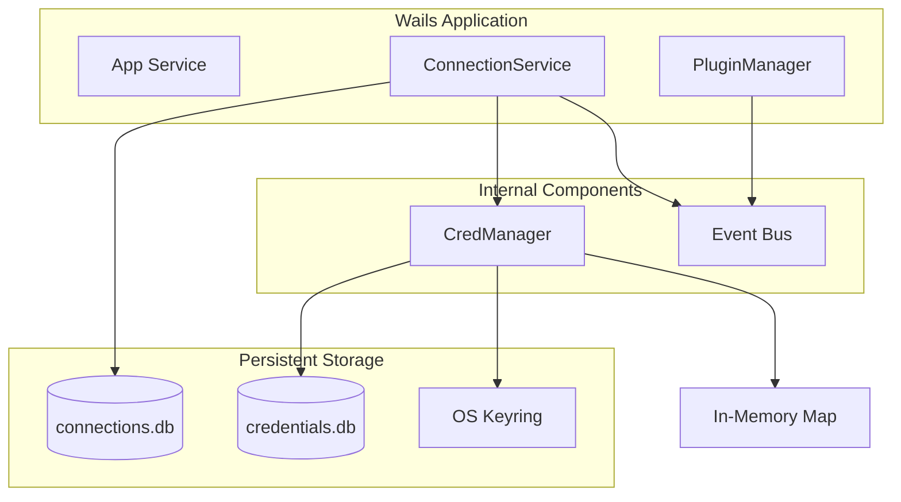
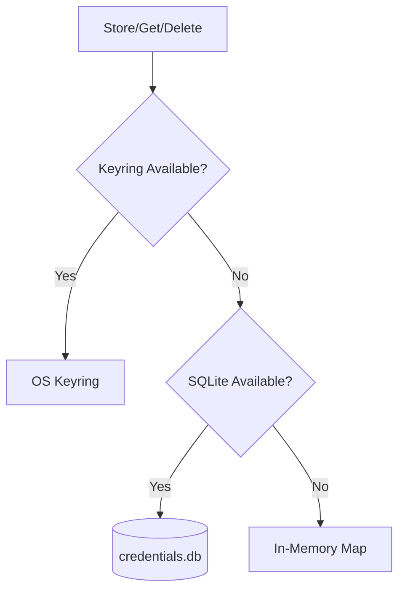

QueryBox's backend is organized into three core services that handle connection management, plugin execution, and credential storage. All services are written in Go and bound to the Wails application for frontend access.

## Service Architecture



## ConnectionService

**Location**: `services/connection.go`  
**Wails Binding**: `github.com/felixdotgo/querybox/services.ConnectionService`

Manages the lifecycle of database connections, including CRUD operations, credential storage, and event emission.

### Data Model

```go
type Connection struct {
    ID            string `json:"id"`            // UUID v4
    Name          string `json:"name"`          // User-defined display name
    DriverType    string `json:"driver_type"`   // Plugin name (e.g., "mysql", "postgres")
    CredentialKey string `json:"credential_key"` // Keyring key ("connection:<uuid>")
    CreatedAt     string `json:"created_at"`    // RFC3339Nano UTC
    UpdatedAt     string `json:"updated_at"`    // RFC3339Nano UTC
}
```

**Note**: The `credential_key` is **not** the actual credential—it's a reference to the secret stored in CredManager.

### Public API

#### ListConnections

```go
ListConnections(ctx context.Context) ([]Connection, error)
```

Returns all stored connections ordered by creation time (newest first).

**Frontend Usage**:
```typescript
import { ListConnections } from '@/bindings/github.com/felixdotgo/querybox/services/connectionservice'

const connections = await ListConnections()
```

**Implementation**: `services/connection.go:177`

---

#### CreateConnection

```go
CreateConnection(ctx context.Context, name string, driverType string, credential string) (Connection, error)
```

Creates a new connection record.

**Parameters**:
- `name`: Display name for the connection
- `driverType`: Plugin identifier (must match a discovered plugin)
- `credential`: JSON-encoded credential blob (structure defined by plugin's auth forms)

**Flow**:
1. Generate UUID for connection ID
2. Derive credential key: `"connection:<uuid>"`
3. Store credential via `CredManager.Store(key, credential)`
4. Insert metadata into `connections.db`
5. Emit `connection:created` event with full Connection object

**Frontend Usage**:
```typescript
import { CreateConnection } from '@/bindings/github.com/felixdotgo/querybox/services/connectionservice'

const cred = JSON.stringify({ host: 'localhost', port: 5432, user: 'admin', password: 'secret' })
const conn = await CreateConnection('My Database', 'postgres', cred)
```

**Implementation**: `services/connection.go:233`

**Emits**: `connection:created` event → Frontend updates connection list reactively (no re-fetch needed)

---

#### GetConnection

```go
GetConnection(ctx context.Context, id string) (Connection, error)
```

Retrieves a single connection by ID.

**Implementation**: `services/connection.go:208`

---

#### GetCredential

```go
GetCredential(ctx context.Context, id string) (string, error)
```

Retrieves the raw credential JSON for a connection.

**Security Note**: This method returns sensitive data. The frontend uses it only when needed (e.g., executing queries, testing connections). Credentials are never cached in frontend state.

**Flow**:
1. Look up connection metadata to get `credential_key`
2. Call `CredManager.Get(credential_key)`
3. Return raw credential string

**Frontend Usage**:
```typescript
import { GetCredential } from '@/bindings/github.com/felixdotgo/querybox/services/connectionservice'

const credJSON = await GetCredential(conn.id)
const cred = JSON.parse(credJSON)
```

**Implementation**: `services/connection.go:273`

---

#### DeleteConnection

```go
DeleteConnection(ctx context.Context, id string) error
```

Deletes a connection and its associated credential.

**Flow**:
1. Look up `credential_key` from connection metadata
2. Best-effort delete from CredManager (ignores errors)
3. Delete row from `connections.db`
4. Emit `connection:deleted` event with connection ID

**Frontend Usage**:
```typescript
import { DeleteConnection } from '@/bindings/github.com/felixdotgo/querybox/services/connectionservice'

await DeleteConnection(conn.id)
// Frontend event listener removes connection from UI state
```

**Implementation**: `services/connection.go:299`

**Emits**: `connection:deleted` event → Frontend removes connection from list

---

### Database Schema

```sql
CREATE TABLE IF NOT EXISTS connections (
    id TEXT PRIMARY KEY,
    name TEXT NOT NULL,
    driver_type TEXT NOT NULL,
    credential_key TEXT,
    created_at DATETIME DEFAULT (strftime('%Y-%m-%dT%H:%M:%fZ','now')),
    updated_at DATETIME DEFAULT (strftime('%Y-%m-%dT%H:%M:%fZ','now'))
);
```

**Location**: Platform-specific user config directory + `querybox/connections.db`

**Migration**: Legacy `credential_blob` column migrated to keyring on service initialization (`services/connection.go:113`)

---

## PluginManager

**Location**: `services/pluginmgr/pluginmgr.go`  
**Wails Binding**: `github.com/felixdotgo/querybox/services/pluginmgr.Manager`

Discovery and on-demand execution of database driver plugins.

### Plugin Discovery

**Scan Locations** (in order of precedence):
1. **User directory**: `<UserConfigDir>/querybox/plugins/`
2. **Bundled directory**: `<executable_dir>/bin/plugins/`

On startup, bundled plugins are **copied** to the user directory to ensure updates ship with new releases.

**Scan Process** (`pluginmgr.go:264`):
- Find all executable files in scan directories
- Probe each with `plugin info` command (5s timeout)
- Parse JSON response to populate metadata
- Store in in-memory registry (`map[string]PluginInfo`)
- Emit `plugins:ready` event when complete

### Plugin Info

```go
type PluginInfo struct {
    ID           string            `json:"id"`           // Filename
    Name         string            `json:"name"`         // Display name from metadata
    Path         string            `json:"path"`         // Full filesystem path
    Running      bool              `json:"running"`      // Always false (on-demand model)
    Type         int               `json:"type"`         // 1 = DRIVER (proto enum)
    Version      string            `json:"version"`
    Description  string            `json:"description"`
    URL          string            `json:"url"`
    Author       string            `json:"author"`
    Capabilities []string          `json:"capabilities"`
    Tags         []string          `json:"tags"`
    License      string            `json:"license"`
    IconURL      string            `json:"icon_url"`
    Contact      string            `json:"contact"`
    Metadata     map[string]string `json:"metadata"`
    Settings     map[string]string `json:"settings"`
    LastError    string            `json:"lastError"`    // Probe failure message
}
```

### Public API

#### ListPlugins

```go
ListPlugins() []PluginInfo
```

Returns all discovered plugins. Does not trigger a rescan.

**Frontend Usage**:
```typescript
import { ListPlugins } from '@/bindings/github.com/felixdotgo/querybox/services/pluginmgr/manager'

const plugins = await ListPlugins()
```

**Implementation**: `pluginmgr.go:456`

---

#### Rescan

```go
Rescan() error
```

Clears the registry and performs a full plugin rescan. Useful after installing new plugins without restarting the app.

**Implementation**: `pluginmgr.go:610`

---

#### ExecPlugin

```go
ExecPlugin(name string, connection map[string]string, query string, options map[string]string) (*plugin.ExecResponse, error)
```

Executes a query via the named plugin.

**Parameters**:
- `name`: Plugin ID (filename)
- `connection`: Credential map (typically parsed from `GetCredential()`)
- `query`: Query string (SQL, NoSQL command, etc.)
- `options`: Optional flags (e.g., `{"explain-query": "yes"}`)

**Flow**:
1. Look up plugin path in registry
2. Spawn subprocess: `<plugin> exec`
3. Write JSON request to stdin:
   ```json
   {
     "connection": {"host": "...", "user": "..."},
     "query": "SELECT * FROM users",
     "options": {}
   }
   ```
4. Read protobuf-JSON response from stdout (30s timeout)
5. Parse into `plugin.ExecResponse`
6. Terminate subprocess

**Response Structure** (protobuf):
```go
type ExecResponse struct {
    Error  string      `json:"error"`   // Non-empty on plugin error
    Result *ExecResult `json:"result"`  // Typed result (SQL/KV/Document)
}

type ExecResult struct {
    Payload isExecResult_Payload `json:"..."`  // Oneof: sql, kv, document
}
```

**Frontend Usage**:
```typescript
import { ExecPlugin } from '@/bindings/github.com/felixdotgo/querybox/services/pluginmgr/manager'
import { GetCredential } from '@/bindings/github.com/felixdotgo/querybox/services/connectionservice'

const credJSON = await GetCredential(conn.id)
const credMap = JSON.parse(credJSON)
const result = await ExecPlugin(conn.driver_type, credMap, 'SELECT * FROM users', {})
```

**Implementation**: `pluginmgr.go:474`

---

#### GetConnectionTree

```go
GetConnectionTree(name string, connection map[string]string) (*plugin.ConnectionTreeResponse, error)
```

Fetches hierarchical structure of database objects (databases → tables → columns).

**Flow**:
1. Spawn `<plugin> connection-tree`
2. Write JSON request: `{"connection": {...}}`
3. Read protobuf-JSON response (30s timeout)
4. Parse into `ConnectionTreeResponse`

**Response Structure**:
```go
type ConnectionTreeResponse struct {
    Nodes []*TreeNode `json:"nodes"`
}

type TreeNode struct {
    Label    string      `json:"label"`      // Display name
    NodeType string      `json:"node_type"`  // "database", "table", "column", etc.
    Children []*TreeNode `json:"children"`   // Recursive children
    Actions  []*Action   `json:"actions"`    // Context menu actions
}
```

**Frontend Usage**:
```typescript
import { GetConnectionTree } from '@/bindings/github.com/felixdotgo/querybox/services/pluginmgr/manager'

const tree = await GetConnectionTree(conn.driver_type, credMap)
```

**Implementation**: `pluginmgr.go:621`

---

#### ExecTreeAction

```go
ExecTreeAction(name string, connection map[string]string, actionQuery string, options map[string]string) (*plugin.ExecResponse, error)
```

Convenience wrapper that delegates to `ExecPlugin()`. Used when a tree node action is clicked.

**Implementation**: `pluginmgr.go:696`

---

#### TestConnection

```go
TestConnection(name string, connection map[string]string) (*plugin.TestConnectionResponse, error)
```

Tests connection parameters **without** persisting a connection.

**Flow**:
1. Spawn `<plugin> test-connection`
2. Write JSON request: `{"connection": {...}}`
3. Read response (15s timeout)
4. Parse into `TestConnectionResponse`

**Response Structure**:
```go
type TestConnectionResponse struct {
    Ok      bool   `json:"ok"`       // true if connection succeeded
    Message string `json:"message"`  // Success message or error details
}
```

**Frontend Usage** (in New Connection form):
```typescript
import { TestConnection } from '@/bindings/github.com/felixdotgo/querybox/services/pluginmgr/manager'

const result = await TestConnection('mysql', { host: 'localhost', user: 'root', password: 'secret' })
if (result.ok) {
  console.log('✓', result.message)
} else {
  console.error('✗', result.message)
}
```

**Implementation**: `pluginmgr.go:706`

---

#### GetPluginAuthForms

```go
GetPluginAuthForms(name string) (map[string]*plugin.AuthForm, error)
```

Retrieves structured authentication form definitions for a plugin.

**Flow**:
1. Spawn `<plugin> authforms`
2. Read protobuf-JSON response (2s timeout)
3. Parse into `map[formID]*AuthForm`

**Response Structure**:
```go
type AuthForm struct {
    Name        string       `json:"name"`         // Form display name
    Description string       `json:"description"`
    Fields      []*FormField `json:"fields"`       // Form fields
}

type FormField struct {
    Key         string `json:"key"`          // Credential map key
    Label       string `json:"label"`        // Display label
    Type        string `json:"type"`         // "text", "password", "number", "file"
    Required    bool   `json:"required"`
    DefaultValue string `json:"default_value"`
}
```

**Frontend Usage**:
```typescript
import { GetPluginAuthForms } from '@/bindings/github.com/felixdotgo/querybox/services/pluginmgr/manager'

const forms = await GetPluginAuthForms('postgres')
// Render dynamic form based on forms['default'].fields
```

**Implementation**: `pluginmgr.go:776`

---

## CredManager

**Location**: `services/credmanager/credmanager.go`  
**Wails Binding**: None (internal service)

Provides secure credential storage with automatic fallback when OS keyring is unavailable.

### Architecture



### Credential Backends

| Backend | Platform Support | Persistence | Use Case |
|---------|------------------|-------------|----------|
| **OS Keyring** | macOS: Keychain<br/>Windows: Credential Manager<br/>Linux: libsecret, KWallet | ✓ Persistent, encrypted | Default for desktop |
| **SQLite** | All platforms | ✓ Persistent, plaintext† | Headless servers, containers |
| **Memory** | All platforms | ✗ Session-only | Filesystem unavailable |

† SQLite credentials are **not** encrypted at rest. Use OS keyring for production.

### Public API

#### Store

```go
Store(key string, secret string) error
```

Stores a secret under the given key.

**Implementation**: `credmanager.go:114`

---

#### Get

```go
Get(key string) (string, error)
```

Retrieves a secret previously stored.

**Returns**: `"secret not found"` error if key doesn't exist.

**Implementation**: `credmanager.go:135`

---

#### Delete

```go
Delete(key string) error
```

Removes a secret. Only the active backend is consulted.

**Implementation**: `credmanager.go:159`

---

#### Backend

```go
Backend() string
```

Returns the active backend: `"keyring"`, `"sqlite"`, or `"memory"`.

**Implementation**: `credmanager.go:177`

---

### Keyring Probing

On initialization, CredManager tests keyring availability:

```go
func probeKeyring() bool {
    keyring.Set("querybox", "__availability_probe__", "__probe__")
    _, err := keyring.Get("querybox", "__availability_probe__")
    keyring.Delete("querybox", "__availability_probe__")
    return err == nil
}
```

**Implementation**: `credmanager.go:49`

If the probe fails, CredManager falls back to SQLite.

---

### SQLite Schema

```sql
CREATE TABLE IF NOT EXISTS credentials (
    key TEXT PRIMARY KEY,
    secret TEXT NOT NULL
);
```

**Location**: `<UserConfigDir>/querybox/credentials.db`

---

## Service Lifecycle

### Initialization (main.go)

```go
func main() {
    connSvc := services.NewConnectionService()  // Opens SQLite, runs migrations
    mgr := pluginmgr.New()                      // Starts async plugin scan

    app := application.New(application.Options{
        Services: []application.Service{
            application.NewService(connSvc),
            application.NewService(mgr),
            application.NewService(appSvc),
        },
    })

    // Inject app reference for event emission
    connSvc.SetApp(app)
    mgr.SetApp(app)

    app.Run()
}
```

### Shutdown

Wails calls `Shutdown()` on all bound services when the app quits:

- **ConnectionService**: Closes SQLite connection (`connection.go:140`)
- **PluginManager**: No-op (no background processes)
- **CredManager**: Call `Close()` manually if needed (not automatic)

---

## Error Handling

### Service Errors
All public methods return `error` as the last return value. Frontend bindings surface these as rejected promises.

**Frontend Example**:
```typescript
try {
  const conn = await CreateConnection('My DB', 'mysql', credJSON)
} catch (err) {
  console.error('Failed to create connection:', err)
}
```

### Plugin Errors
Plugin failures are captured in the response:

```go
resp, err := mgr.ExecPlugin(...)
if err != nil {
    // Subprocess timeout, crash, or invalid JSON
}
if resp.Error != "" {
    // Plugin reported an error (e.g., syntax error)
}
```

### Event Emission Errors
Event emission is **nil-safe**. If `app` is nil (e.g., in tests), events are silently dropped.

---

## Testing

### Unit Tests
Services are designed to be testable without Wails:

```go
svc := NewConnectionService()  // No app reference
conn, err := svc.CreateConnection(ctx, "test", "mysql", credJSON)
// Events not emitted (app is nil)
```

### Mocking
Internal dependencies use function variables for test injection:

```go
// credmanager_test.go
keyringSet = func(service, key, secret string) error {
    return errors.New("mock error")
}
```

**Examples**:
- `credmanager/credmanager_test.go`
- `connection_test.go`
- `pluginmgr/pluginmgr_test.go`

---

## Next Steps

- [System Architecture Overview](./overview) - High-level system design
- [Frontend Architecture](./frontend) - Vue 3 components and composables
- [Event System](./event-system) - Event contracts and patterns
